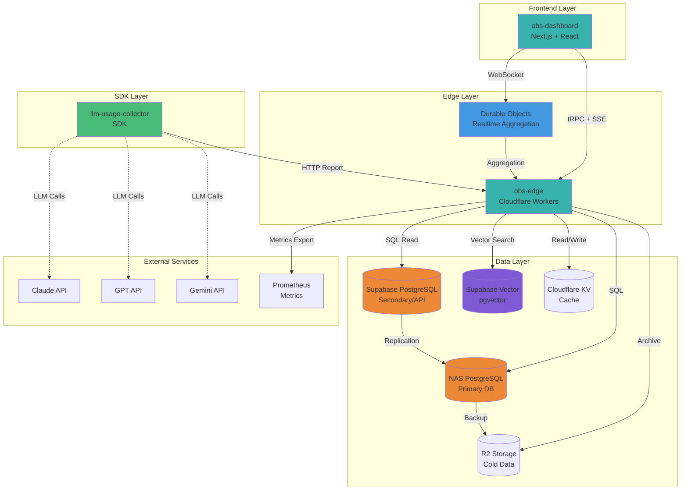
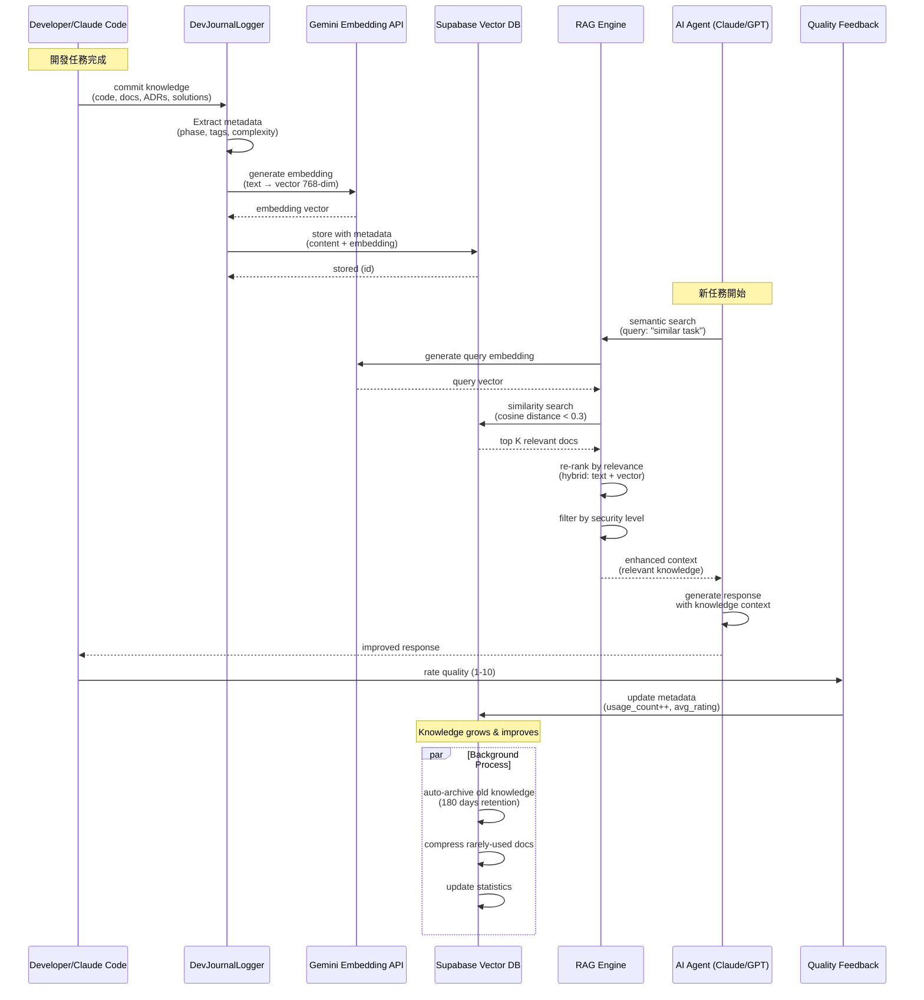

# CLAUDE.md - Genesis Observability Platform

> **Documentation Version**: 2.0 (Enterprise Grade)
> **Last Updated**: 2025-01-07
> **Project**: Genesis Observability - 企業級 AI 協作平台可觀測性系統
> **Status**: Phase 0 ✅ Complete (91/100) | Phase 1 🔄 In Planning
> **Commercial Grade**: Production-Ready with Enterprise Standards
> **Architecture Review**: ✅ Passed Strategic Review

This file provides comprehensive guidance to Claude Code for maintaining **consistency, professionalism, highest quality, and commercial viability** throughout the development lifecycle.

---

## 📌 專案定位與商業價值

### 🎯 核心價值主張

Genesis Observability 是新一代 **AI 協作平台的智能可觀測性與成本追蹤系統**，採用：

**🏆 五大核心競爭力：**

1. **Multi-LLM 智能路由** - 品質優先策略（Claude/GPT/Gemini），平衡成本與效能
2. **知識循環系統** - 開發知識自動累積與 AI 自主訓練（RAG + Vector DB）
3. **Phase-based 交付** - 品質閘門（>= 85/100）確保零技術債
4. **Zero-Conflict 架構** - 與 Factory OS 完全隔離，可獨立商用化
5. **邊緣+主權混合方案** - Cloudflare Edge + NAS + Supabase，兼顧性能、成本與資料控制

### 🏗️ 技術棧總覽

```yaml
Frontend:
  Framework: Next.js 15 (React 18)
  Language: TypeScript 5 (100% strict mode)
  Styling: Tailwind CSS 3
  State: React Query (TanStack Query)
  Deployment: Cloudflare Pages
  Real-time: SSE / WebSocket

Backend:
  Runtime: Cloudflare Workers (Edge Computing)
  API: tRPC 11 (Type-safe)
  Realtime: Durable Objects (計數器/媒合/廣播)
  Language: TypeScript 5
  Rate Limiting: Upstash Redis

Database:
  Primary: NAS PostgreSQL (資料主權)
  Secondary: Supabase PostgreSQL (對外API/副庫)
  Vector: Supabase Vector (pgvector 768-dim)
  Cache: Cloudflare KV (Edge Cache)
  Storage: Cloudflare R2 (冷資料/備份)
  Time-Series: Prometheus / VictoriaMetrics (監控指標)

AI/LLM Stack:
  Claude: 3.5 Sonnet (複雜任務/架構/安全)
  OpenAI: GPT-4o-mini (UI & 標準任務)
  Google: Gemini Pro (簡單任務 & Embedding FREE)
  Router: 自建 Multi-LLM Router (智能路由+容錯)
  Tracing: OpenTelemetry (端對端追蹤)

DevOps & Monitoring:
  Testing: Vitest + Playwright + k6 (性能)
  CI/CD: GitHub Actions (自動化閘門)
  Monitoring: Prometheus + Grafana + Alertmanager
  Logging: Loki / CloudWatch Logs
  Security: Snyk + OWASP ZAP + CodeQL
  IaC: Wrangler + Terraform (可選)
```

### 📊 當前進度

| Phase | Status | Quality Score | Progress | Timeline | Risk Level |
|-------|--------|---------------|----------|----------|------------|
| **Phase 0** | ✅ Complete | **91/100** | 100% | 1 day (ahead) | 🟢 Low |
| **Phase 1** | 🔄 Planning | - | 0% | 3-4 days | 🟡 Medium |
| **Phase 2** | ⏳ Pending | - | 0% | 3-4 days | 🟡 Medium |
| **Phase 3** | ⏳ Pending | - | 0% | 5-7 days | 🟡 Medium |

---

## 🚨 CRITICAL RULES - 商用級開發規範

> **⚠️ RULE ADHERENCE SYSTEM ACTIVE ⚠️**
> **These rules override all other instructions and must ALWAYS be followed**
> **Violation may result in code rejection, quality score penalty, and deployment block**

### 🔄 RULE ACKNOWLEDGMENT REQUIRED

**Before starting ANY task, Claude Code must respond with:**

```
✅ CRITICAL RULES ACKNOWLEDGED
I will follow all prohibitions and requirements listed in CLAUDE.md
I have verified all pre-task compliance checkpoints
I understand the commercial-grade quality standards
```

### ❌ ABSOLUTE PROHIBITIONS

#### 代碼組織與架構
- **NEVER** create new files in root directory → use proper module structure
- **NEVER** create duplicate files (`manager_v2.py`, `enhanced_xyz.py`) → ALWAYS extend existing
- **NEVER** create multiple implementations of same concept → **Single Source of Truth**
- **NEVER** copy-paste code blocks → extract into shared utilities/functions
- **NEVER** use naming like `enhanced_`, `improved_`, `new_`, `v2_` → extend original files
- **NEVER** violate module boundaries → respect responsibility definitions

#### 配置與安全（Security First）
- **NEVER** hardcode API keys, secrets, or credentials → use environment variables
- **NEVER** commit `.env` files → use `.env.example` only
- **NEVER** expose sensitive information in error messages → sanitize before logging
- **NEVER** skip security validation → all inputs must be validated (Zod schemas)
- **NEVER** bypass authentication/authorization → enforce JWT + RLS + Zero Trust
- **NEVER** store plaintext passwords → use bcrypt/argon2 hashing

#### Git 與流程
- **NEVER** use git commands with `-i` flag (interactive mode not supported)
- **NEVER** commit without testing → run tests first (`pnpm test`)
- **NEVER** skip documentation → update docs with code changes
- **NEVER** force push to main/master branch → protect production branches
- **NEVER** merge PRs without dual review → require 2+ approvals
- **NEVER** deploy without passing CI/CD gates → all checks must pass

#### 工具使用
- **NEVER** use `find`, `grep`, `cat`, `head`, `tail`, `ls` → use Read, Grep, Glob tools
- **NEVER** use bash for file operations → use specialized tools (Read/Write/Edit)
- **NEVER** run long operations without Task agents → bash stops on context switch
- **NEVER** bypass linting/type checking → must pass ESLint + TypeScript strict

### ✅ MANDATORY REQUIREMENTS

#### 品質保證（Quality First）
- **COMMIT** after every completed task/phase - no exceptions
- **GITHUB BACKUP** - Push to GitHub after every commit: `git push origin main`
- **TEST FIRST** - Write tests before or with implementation (TDD encouraged)
- **READ FILES FIRST** - Edit/Write tools will fail if you didn't read the file first
- **TYPE SAFETY** - 100% TypeScript strict mode, no `any` types (use `unknown` + type guards)
- **DOCUMENTATION** - All public functions must have JSDoc comments
- **CODE REVIEW** - All PRs require dual review before merge

#### 工作流程（Systematic Approach）
- **USE TASK AGENTS** for all long-running operations (>30 seconds)
- **TODOWRITE** for complex tasks (3+ steps) → parallel agents → git checkpoints
- **SEARCH FIRST** - Before creating new files, check for existing similar functionality
- **SINGLE SOURCE OF TRUTH** - One authoritative implementation per feature/concept
- **MODULAR DESIGN** - Respect module boundaries and responsibility definitions

#### 技術債務預防（Debt Prevention）
- **DEBT PREVENTION** - No shortcuts, build clean from the start
- **IMMEDIATE CLEANUP** - Fix technical debt in the same Phase (zero carry-forward)
- **QUALITY GATE** - >= 85/100 required to proceed to next Phase
- **REFACTOR REGULARLY** - Quarterly Tech Debt Cleanup Sprint

#### 安全與合規（Security & Compliance）
- **SECURITY FIRST** - All API endpoints require authentication
- **AUDIT LOGGING** - All critical operations must be logged with timestamp + user
- **LEAST PRIVILEGE** - Grant minimum necessary permissions
- **KEY ROTATION** - API keys must be rotatable without downtime

### 🔍 MANDATORY PRE-TASK COMPLIANCE CHECK

> **STOP: Before starting any task, explicitly verify ALL checkpoints:**

#### Step 1: Rule Acknowledgment ✅
- [ ] I acknowledge all critical rules in CLAUDE.md and will follow them
- [ ] I understand the commercial-grade quality standards
- [ ] I have read the module boundary definitions

#### Step 2: Task Analysis 🔎
- [ ] Will this create files in root? → If YES, use proper module structure
- [ ] Will this take >30 seconds? → If YES, use Task agents not Bash
- [ ] Is this 3+ steps? → If YES, use TodoWrite breakdown first
- [ ] Am I about to use grep/find/cat? → If YES, use proper tools instead
- [ ] Does this require API keys? → If YES, verify environment variables
- [ ] Does this modify module boundaries? → If YES, update architecture docs

#### Step 3: Technical Debt Prevention 🚧
- [ ] **SEARCH FIRST**: `Grep pattern="<functionality>.*<keyword>"` to find existing
- [ ] **CHECK EXISTING**: Read found files to understand current functionality
- [ ] Does similar functionality exist? → If YES, extend existing code
- [ ] Am I creating duplicate class/manager? → If YES, consolidate instead
- [ ] Will this create multiple sources of truth? → If YES, redesign approach
- [ ] Can I extend existing code instead? → Prefer extension over creation
- [ ] Am I about to copy-paste code? → Extract to shared utility instead

#### Step 4: Quality Assurance ✨
- [ ] Have I written tests? → If NO, write tests first (TDD)
- [ ] Is TypeScript strict mode satisfied? → Run `pnpm typecheck`
- [ ] Have I updated documentation? → Update README/CLAUDE.md/API docs
- [ ] Will this pass CI/CD gates? → Verify lint, type check, tests, security
- [ ] Have I checked test coverage? → Run `pnpm test:coverage` (>= 80%)

#### Step 5: Security Check 🔐
- [ ] Are all inputs validated? → Use Zod schemas
- [ ] Are API keys in environment variables? → Never hardcode
- [ ] Are error messages sanitized? → No sensitive data exposure
- [ ] Is authentication enforced? → JWT + RLS policies
- [ ] Are audit logs created? → Critical operations must log

#### Step 6: Session Management ⏱️
- [ ] Is this a long/complex task? → If YES, plan context checkpoints
- [ ] Have I been working >1 hour? → If YES, consider `/compact` or break
- [ ] Have I committed recently? → Commit every 30-60 minutes

> **⚠️ DO NOT PROCEED until all checkboxes are explicitly verified**

---

## 📦 模組責任界定 (Module Boundary Definition)

### 系統模組架構

```
genesis-observability/
├── apps/
│   ├── obs-dashboard/          # 前端展示層（Dashboard UI）
│   │   ├── src/
│   │   │   ├── app/           # Next.js App Router
│   │   │   ├── components/    # React Components (UI only)
│   │   │   ├── hooks/         # Custom Hooks (useMetrics, useSSE)
│   │   │   ├── lib/           # Client Utilities
│   │   │   └── styles/        # Tailwind CSS
│   │   └── package.json
│   │
│   └── obs-edge/              # 邊緣計算 API 層（Edge Workers）
│       ├── src/
│       │   ├── handlers/      # API Handlers (tRPC routers)
│       │   ├── durable-objects/ # Realtime Aggregation
│       │   ├── middlewares/   # Rate Limiting, Auth, CORS
│       │   └── utils/         # Edge Utilities
│       └── wrangler.toml
│
├── packages/
│   ├── obs-types/             # 唯一真實資料契約（Single Source of Truth）
│   │   ├── src/
│   │   │   ├── api/          # API Request/Response Types
│   │   │   ├── domain/       # Domain Models (Metric, Event, Cost)
│   │   │   ├── schemas/      # Zod Validation Schemas
│   │   │   └── constants/    # Shared Constants (NO magic numbers)
│   │   └── package.json
│   │
│   ├── llm-usage-collector/   # LLM 成本追蹤 SDK
│   │   ├── src/
│   │   │   ├── collectors/    # Claude, GPT, Gemini Collectors
│   │   │   ├── reporters/     # 統一報告格式（Unified Format）
│   │   │   ├── tracers/       # OpenTelemetry Integration
│   │   │   └── types/         # Collector Types
│   │   └── package.json
│   │
│   └── shared-utils/          # 共享工具函數（Shared Utilities）
│       ├── src/
│       │   ├── date/         # Date formatting, timezone
│       │   ├── validation/   # Common validators
│       │   ├── crypto/       # Encryption, hashing
│       │   └── logger/       # Structured logging
│       └── package.json
│
└── infra/
    ├── cloudflare/            # IaC, 部署, 權限（Infrastructure as Code）
    │   ├── workers/          # Wrangler configs
    │   ├── pages/            # Pages configs
    │   ├── terraform/        # Terraform IaC (optional)
    │   └── scripts/          # Deployment scripts
    │
    └── supabase/              # Schema, RLS, Migration
        ├── migrations/        # SQL Migrations (versioned)
        ├── seed.sql          # Seed Data
        ├── schema.sql        # Complete Schema
        └── rls-policies.sql  # Row Level Security Policies
```

### 模組職責清單（Responsibility Matrix）

| 模組 | 職責 (Responsibilities) | 邊界 (Boundaries) | 依賴 (Dependencies) | 禁止事項 (Prohibitions) |
|------|------------------------|-------------------|---------------------|------------------------|
| **obs-dashboard** | • 前端UI呈現<br/>• SSE/WebSocket訂閱<br/>• 圖表可視化<br/>• 用戶交互 | • 不處理業務邏輯<br/>• 僅消費API<br/>• 不直接訪問DB | obs-types<br/>tRPC client<br/>React Query | ❌ 不可繞過API直接訪問DB<br/>❌ 不可在前端做複雜計算<br/>❌ 不可硬編碼API端點 |
| **obs-edge** | • Workers + Durable Object API<br/>• 實時聚合（時間窗口）<br/>• Rate Limiting<br/>• 認證授權 | • 不處理前端渲染<br/>• 僅提供API<br/>• 不存儲長期狀態 | obs-types<br/>Supabase<br/>KV<br/>R2 | ❌ 不可執行長時間操作（>10s）<br/>❌ 不可在Worker做複雜AI推理<br/>❌ 不可繞過Rate Limiting |
| **obs-types** | • 唯一真實資料契約<br/>• Zod schemas<br/>• Type definitions<br/>• Constants | • 不包含實作邏輯<br/>• 僅類型定義<br/>• 純資料結構 | Zod | ❌ 不可在此包含業務邏輯<br/>❌ 不可依賴其他packages<br/>❌ 不可有副作用（side effects） |
| **llm-usage-collector** | • 三模型統一報告格式<br/>• 成本計算<br/>• 使用量追蹤<br/>• OpenTelemetry Tracing | • 不處理儲存<br/>• 僅收集與格式化<br/>• 不呼叫LLM API | obs-types<br/>OpenTelemetry | ❌ 不可直接寫入DB<br/>❌ 不可修改metric格式<br/>❌ 不可儲存API keys |
| **infra/cloudflare** | • IaC配置<br/>• 部署腳本<br/>• 權限管理<br/>• 環境變數管理 | • 不包含應用代碼<br/>• 僅基礎設施配置 | Wrangler CLI<br/>Terraform (optional) | ❌ 不可包含應用邏輯<br/>❌ 不可硬編碼secrets<br/>❌ 不可手動部署（須自動化） |
| **infra/supabase** | • Schema定義<br/>• RLS policies<br/>• Migration pipeline<br/>• Seed data | • 不處理應用邏輯<br/>• 僅資料庫結構 | Supabase CLI<br/>PostgreSQL | ❌ 不可在migration中包含應用邏輯<br/>❌ 不可繞過RLS<br/>❌ 不可手動修改production schema |

### 模組間通訊協議（Communication Protocols）



### 跨模組協作範例（Cross-Module Example）

#### 場景：新增 LLM 成本追蹤功能

```typescript
// ✅ CORRECT: 遵循模組邊界

// Step 1: obs-types 定義契約（Single Source of Truth）
// packages/obs-types/src/domain/cost.ts
export interface LLMCost {
  id: string;
  model: string;
  provider: 'claude' | 'gpt' | 'gemini';
  inputTokens: number;
  outputTokens: number;
  cost: number;
  timestamp: Date;
}

// packages/obs-types/src/schemas/cost.ts
import { z } from 'zod';
export const llmCostSchema = z.object({
  model: z.string(),
  provider: z.enum(['claude', 'gpt', 'gemini']),
  inputTokens: z.number().int().min(0),
  outputTokens: z.number().int().min(0),
  cost: z.number().min(0),
  timestamp: z.date()
});

// Step 2: llm-usage-collector 收集數據
// packages/llm-usage-collector/src/reporters/unified-reporter.ts
import { LLMCost, llmCostSchema } from '@obs/types';

export class UnifiedReporter {
  async report(cost: LLMCost): Promise<void> {
    const validated = llmCostSchema.parse(cost); // 使用共享schema驗證
    await this.sendToEdge(validated);
  }
}

// Step 3: obs-edge 接收並存儲
// apps/obs-edge/src/handlers/cost.ts
import { LLMCost, llmCostSchema } from '@obs/types';

export const costRouter = router({
  report: procedure
    .input(llmCostSchema) // 使用共享schema驗證
    .mutation(async ({ input, ctx }) => {
      await ctx.db.insert(llmCosts).values(input);
      await ctx.cache.invalidate('costs:latest');
    })
});

// Step 4: obs-dashboard 展示
// apps/obs-dashboard/src/hooks/useCosts.ts
import { LLMCost } from '@obs/types';

export function useCosts() {
  return trpc.cost.list.useQuery<LLMCost[]>();
}
```

---

## 🧱 CI/CD Gate Policy（品質閘門）

### Phase 品質閘門標準

**每個 Phase 必須達到 >= 85/100 才能進入下一階段**

#### 品質分數計算公式

```typescript
品質分數 = (
  功能完整性 × 0.25 +   // 所有交付物100%完成
  測試覆蓋率 × 0.20 +   // >= 80% coverage
  代碼品質 × 0.20 +     // Lint 0 errors, TypeScript 100% strict
  性能指標 × 0.15 +     // P95 < SLA target
  安全性 × 0.10 +       // 0 critical/high vulnerabilities
  文檔完整度 × 0.10     // >= 90% documentation
) × 100

通過標準: >= 85/100
優秀標準: >= 90/100
```

### 自動化檢查清單（CI/CD Gates）

每次提交（Commit）/ PR 前必須通過以下 6 大檢查：

#### ✅ 1. Lint Check（代碼風格）

```bash
# ESLint + Prettier
pnpm lint                # Check all packages
pnpm format:check        # Check formatting

# 通過標準
✓ 0 errors
✓ 0 warnings (允許最多 5 個 info level)
✓ 所有文件格式一致
```

**配置範例：**
```json
// .eslintrc.json
{
  "extends": ["next/core-web-vitals", "prettier"],
  "rules": {
    "no-console": "warn",
    "no-debugger": "error",
    "@typescript-eslint/no-explicit-any": "error",
    "@typescript-eslint/no-unused-vars": "error"
  }
}
```

#### ✅ 2. Type Check（類型檢查）

```bash
# TypeScript Strict Mode
pnpm typecheck           # All packages
tsc --noEmit --strict    # Manual check

# 通過標準
✓ 0 type errors
✓ 100% type coverage
✓ No 'any' types (除非明確標註 @ts-expect-error)
✓ All functions have return types
```

**tsconfig.json 要求：**
```json
{
  "compilerOptions": {
    "strict": true,
    "noImplicitAny": true,
    "strictNullChecks": true,
    "strictFunctionTypes": true,
    "strictPropertyInitialization": true,
    "noImplicitThis": true,
    "noUnusedLocals": true,
    "noUnusedParameters": true,
    "noImplicitReturns": true,
    "noFallthroughCasesInSwitch": true
  }
}
```

#### ✅ 3. Unit Test Coverage（單元測試覆蓋率）

```bash
# Vitest with Coverage
pnpm test:coverage

# 通過標準
✓ Test Coverage: >= 80%
  ├─ Statements: >= 80%
  ├─ Branches: >= 75%
  ├─ Functions: >= 80%
  └─ Lines: >= 80%
✓ All tests passing: 100%
✓ No skipped tests (除非標註 JIRA ticket)
```

**覆蓋率報告範例：**
```
File                  | % Stmts | % Branch | % Funcs | % Lines |
----------------------|---------|----------|---------|---------|
All files             |   85.23 |    78.45 |   88.12 |   85.67 |
 obs-edge/handlers    |   92.15 |    85.33 |   94.44 |   93.21 |
 obs-types/schemas    |   100.0 |    100.0 |   100.0 |   100.0 |
 llm-collector        |   78.92 |    72.11 |   82.35 |   79.45 | ⚠️
```

#### ✅ 4. E2E Test（端對端測試）

```bash
# Playwright E2E Tests
pnpm test:e2e
pnpm test:e2e:ui     # With UI mode

# 通過標準
✓ Critical user flows: 100% passing
  ├─ Dashboard load & metrics display
  ├─ Real-time updates (SSE)
  ├─ Cost filtering & export
  └─ LLM usage tracking
✓ Browser compatibility: Chrome, Firefox, Safari
✓ Performance: P95 < 3s (first contentful paint)
✓ Accessibility: WCAG 2.1 AA compliance
```

**E2E 測試範例：**
```typescript
// e2e/dashboard.spec.ts
test('dashboard loads and displays metrics', async ({ page }) => {
  await page.goto('/dashboard');

  // Check metrics loaded
  await expect(page.locator('[data-testid="metrics-chart"]')).toBeVisible();

  // Check real-time updates
  const metricBefore = await page.locator('[data-testid="total-cost"]').textContent();
  await page.waitForTimeout(5000); // Wait for SSE update
  const metricAfter = await page.locator('[data-testid="total-cost"]').textContent();
  expect(metricAfter).not.toBe(metricBefore);
});
```

#### ✅ 5. No Critical Dependency Warning

```bash
# Check for vulnerable dependencies
pnpm audit --production
pnpm outdated

# 通過標準
✓ 0 critical vulnerabilities
✓ 0 high vulnerabilities
✓ Medium/Low: Review and document exceptions
✓ All dependencies up-to-date (within 3 months)
```

**依賴管理策略：**
- 每月第一週執行 `pnpm update --interactive`
- 重大安全漏洞：24小時內修復
- 高危漏洞：7天內修復
- 中危漏洞：30天內修復

#### ✅ 6. Security Scan（安全掃描）

```bash
# Snyk / CodeQL / OWASP ZAP
pnpm security:scan
snyk test --all-projects
codeql database analyze

# 通過標準
✓ 0 critical security issues
✓ 0 high security issues
✓ API keys not hardcoded
✓ No sensitive data exposure in logs
✓ SQL injection防護 (Parameterized queries)
✓ XSS防護 (Input sanitization)
✓ CSRF防護 (Token validation)
```

**安全檢查清單：**
```yaml
Authentication:
  - [x] JWT tokens with expiration
  - [x] Refresh token rotation
  - [x] Password hashing (bcrypt/argon2)

Authorization:
  - [x] Row Level Security (RLS) policies
  - [x] Role-based access control (RBAC)
  - [x] Least privilege principle

Data Protection:
  - [x] HTTPS enforced (no HTTP)
  - [x] Sensitive data encrypted at rest
  - [x] API keys in environment variables
  - [x] Input validation (Zod schemas)

Audit & Compliance:
  - [x] Audit logs for critical operations
  - [x] GDPR compliance (data deletion)
  - [x] Rate limiting (DDoS protection)
```

### GitHub Actions CI/CD Pipeline

```yaml
# .github/workflows/ci.yml
name: CI/CD Quality Gates

on:
  push:
    branches: [main, develop]
  pull_request:
    branches: [main]

jobs:
  quality-gate:
    runs-on: ubuntu-latest
    timeout-minutes: 30

    steps:
      - uses: actions/checkout@v4
      - uses: pnpm/action-setup@v2
        with:
          version: 8
      - uses: actions/setup-node@v4
        with:
          node-version: '18'
          cache: 'pnpm'

      - name: Install Dependencies
        run: pnpm install --frozen-lockfile

      - name: ✅ Gate 1 - Lint Check
        run: pnpm lint

      - name: ✅ Gate 2 - Type Check
        run: pnpm typecheck

      - name: ✅ Gate 3 - Unit Tests
        run: pnpm test:coverage

      - name: Upload Coverage
        uses: codecov/codecov-action@v3
        with:
          files: ./coverage/lcov.info

      - name: ✅ Gate 4 - E2E Tests
        run: pnpm test:e2e

      - name: ✅ Gate 5 - Dependency Audit
        run: pnpm audit --production --audit-level=high

      - name: ✅ Gate 6 - Security Scan
        uses: snyk/actions/node@master
        env:
          SNYK_TOKEN: ${{ secrets.SNYK_TOKEN }}

      - name: Build
        run: pnpm build

      - name: Deploy Preview (PR only)
        if: github.event_name == 'pull_request'
        run: pnpm deploy:preview
        env:
          CLOUDFLARE_API_TOKEN: ${{ secrets.CLOUDFLARE_API_TOKEN }}

      - name: Deploy Production (main branch only)
        if: github.ref == 'refs/heads/main' && github.event_name == 'push'
        run: pnpm deploy:production
        env:
          CLOUDFLARE_API_TOKEN: ${{ secrets.CLOUDFLARE_API_TOKEN }}
          SUPABASE_ACCESS_TOKEN: ${{ secrets.SUPABASE_ACCESS_TOKEN }}

  performance-test:
    runs-on: ubuntu-latest
    needs: quality-gate
    if: github.ref == 'refs/heads/main'

    steps:
      - uses: actions/checkout@v4
      - name: Run k6 Load Test
        uses: grafana/k6-action@v0.3.1
        with:
          filename: tests/load/scenario.js
          cloud: true
          token: ${{ secrets.K6_CLOUD_TOKEN }}
```

### Branch Protection Rules（分支保護規則）

**main / production 分支必須設定：**
```yaml
Branch Protection:
  - Require pull request reviews: 2 approvals minimum
  - Require status checks to pass:
    ✓ Lint Check
    ✓ Type Check
    ✓ Unit Tests (>= 80% coverage)
    ✓ E2E Tests
    ✓ Security Scan
  - Require branches to be up to date
  - Require linear history (no merge commits)
  - Require signed commits (GPG)
  - Include administrators: Yes
  - Restrict who can push: CI/CD bot only
```

---

## 🪪 模型授權與版控策略

### AI 回應追溯性（AI Response Traceability）

**所有 AI 回應（Claude/Gemini/GPT）均須保存至 `/logs/ai-trace`**，用於可追溯性、審核與合規。

#### 日誌格式規範

```typescript
// /logs/ai-trace/{YYYY-MM-DD}/{HH-mm-ss}-{model}-{requestId}.json
interface AITraceLog {
  // 基本資訊
  timestamp: string;          // ISO 8601格式
  requestId: string;          // UUID v4
  model: string;              // "claude-3-5-sonnet-20241022"
  provider: 'anthropic' | 'openai' | 'google';

  // 請求內容
  request: {
    messages: Message[];
    temperature: number;
    max_tokens: number;
    system?: string;
  };

  // 回應內容
  response: {
    content: string;
    usage: {
      prompt_tokens: number;
      completion_tokens: number;
      total_tokens: number;
    };
    cost: number;            // USD
    latency: number;         // milliseconds
    finish_reason: string;
  };

  // 任務元數據
  task: {
    type: 'architecture_design' | 'code_generation' | 'code_review' | 'documentation' | 'testing';
    complexity: number;      // 1-10
    security_critical: boolean;
    phase: string;           // "Phase 1"
  };

  // 追溯資訊
  metadata: {
    commit: string;          // Git commit hash
    branch: string;
    user: string;            // "claude-code" or actual user
    session_id: string;
    parent_request_id?: string; // For multi-turn conversations
  };

  // 合規標記
  compliance: {
    confidential: boolean;   // 是否包含敏感資訊
    retention_days: number;  // 保留天數（預設180天）
    gdpr_compliant: boolean;
  };
}
```

#### 儲存與查詢範例

```typescript
// services/ai-trace-logger.ts
import { createHash } from 'crypto';
import { writeFile, mkdir } from 'fs/promises';
import path from 'path';

export class AITraceLogger {
  private baseDir = './logs/ai-trace';

  async log(trace: AITraceLog): Promise<void> {
    // 創建日期目錄
    const date = new Date(trace.timestamp);
    const dateDir = date.toISOString().split('T')[0];
    const dirPath = path.join(this.baseDir, dateDir);
    await mkdir(dirPath, { recursive: true });

    // 文件名：{時間}-{模型}-{requestId}.json
    const time = date.toTimeString().split(' ')[0].replace(/:/g, '-');
    const filename = `${time}-${trace.model}-${trace.requestId}.json`;
    const filePath = path.join(dirPath, filename);

    // 寫入日誌
    await writeFile(filePath, JSON.stringify(trace, null, 2));

    // 同步到 Supabase（異步，不阻塞）
    this.syncToSupabase(trace).catch(console.error);
  }

  private async syncToSupabase(trace: AITraceLog): Promise<void> {
    await supabase.from('ai_trace_logs').insert({
      request_id: trace.requestId,
      timestamp: trace.timestamp,
      model: trace.model,
      provider: trace.provider,
      cost: trace.response.cost,
      latency: trace.response.latency,
      tokens: trace.response.usage.total_tokens,
      task_type: trace.task.type,
      phase: trace.task.phase,
      confidential: trace.compliance.confidential
    });
  }

  // 查詢最近的 AI 互動
  async queryRecent(limit: number = 10): Promise<AITraceLog[]> {
    const { data } = await supabase
      .from('ai_trace_logs')
      .select('*')
      .order('timestamp', { ascending: false })
      .limit(limit);

    return data || [];
  }

  // 查詢特定 Phase 的成本
  async getCostByPhase(phase: string): Promise<number> {
    const { data } = await supabase
      .from('ai_trace_logs')
      .select('cost')
      .eq('phase', phase);

    return data?.reduce((sum, row) => sum + row.cost, 0) || 0;
  }
}
```

### Prompt 模板版本化管理

**重要 Prompt 模板需版本化管理（Git tag + meta.json）**

#### 目錄結構

```
prompts/
├── architecture-design/
│   ├── v1.0.0/
│   │   ├── prompt.md
│   │   ├── meta.json
│   │   └── examples/
│   │       ├── input1.md
│   │       └── output1.md
│   ├── v1.1.0/
│   │   ├── prompt.md
│   │   ├── meta.json
│   │   └── CHANGELOG.md
│   └── latest -> v1.1.0  # Symlink
│
├── code-review/
│   └── v1.0.0/
│       ├── prompt.md
│       └── meta.json
│
└── security-audit/
    └── v1.0.0/
        ├── prompt.md
        ├── meta.json
        └── checklist.md
```

#### meta.json 規範

```json
{
  "version": "1.1.0",
  "created": "2025-01-07",
  "updated": "2025-01-15",
  "author": "Claude Code",
  "reviewers": ["John Doe", "Jane Smith"],

  "description": "System architecture design prompt for complex multi-module systems",

  "tags": [
    "architecture",
    "system-design",
    "enterprise",
    "multi-tenant"
  ],

  "confidential": false,

  "model_requirements": {
    "min_complexity": 8,
    "preferred_model": "claude-3-5-sonnet",
    "fallback_models": ["gpt-4o", "gpt-4o-mini"],
    "min_context_window": 100000,
    "temperature": 0.7,
    "max_tokens": 4096
  },

  "validation": {
    "required_sections": [
      "System Overview",
      "Architecture Diagram",
      "Component Responsibilities",
      "Security Considerations",
      "Scalability Plan"
    ],
    "min_length": 2000,
    "max_length": 10000
  },

  "changelog": [
    {
      "version": "1.1.0",
      "date": "2025-01-15",
      "changes": [
        "Added multi-tenant considerations",
        "Enhanced security section",
        "Added cost estimation template"
      ]
    },
    {
      "version": "1.0.0",
      "date": "2025-01-07",
      "changes": [
        "Initial version"
      ]
    }
  ],

  "deprecation": {
    "deprecated": false,
    "deprecated_date": null,
    "replacement_version": null
  }
}
```

#### Prompt 版本管理工具

```typescript
// tools/prompt-version-manager.ts
import { readFile, writeFile } from 'fs/promises';
import path from 'path';
import semver from 'semver';

export class PromptVersionManager {
  private promptsDir = './prompts';

  // 載入特定版本的 Prompt
  async load(
    category: string,
    version: string = 'latest'
  ): Promise<{ prompt: string; meta: PromptMeta }> {
    const versionDir = version === 'latest'
      ? path.join(this.promptsDir, category, 'latest')
      : path.join(this.promptsDir, category, `v${version}`);

    const [prompt, meta] = await Promise.all([
      readFile(path.join(versionDir, 'prompt.md'), 'utf-8'),
      readFile(path.join(versionDir, 'meta.json'), 'utf-8').then(JSON.parse)
    ]);

    return { prompt, meta };
  }

  // 創建新版本
  async createVersion(
    category: string,
    newVersion: string,
    changes: string[]
  ): Promise<void> {
    // 驗證版本號
    if (!semver.valid(newVersion)) {
      throw new Error(`Invalid version: ${newVersion}`);
    }

    // 載入當前最新版本
    const { prompt: oldPrompt, meta: oldMeta } = await this.load(category);

    // 確認版本遞增
    if (!semver.gt(newVersion, oldMeta.version)) {
      throw new Error(
        `New version ${newVersion} must be greater than current ${oldMeta.version}`
      );
    }

    // 創建新版本目錄
    const newVersionDir = path.join(this.promptsDir, category, `v${newVersion}`);
    await mkdir(newVersionDir, { recursive: true });

    // 更新 meta.json
    const newMeta = {
      ...oldMeta,
      version: newVersion,
      updated: new Date().toISOString().split('T')[0],
      changelog: [
        {
          version: newVersion,
          date: new Date().toISOString().split('T')[0],
          changes
        },
        ...oldMeta.changelog
      ]
    };

    // 寫入文件
    await Promise.all([
      writeFile(path.join(newVersionDir, 'prompt.md'), oldPrompt),
      writeFile(path.join(newVersionDir, 'meta.json'), JSON.stringify(newMeta, null, 2)),
      writeFile(path.join(newVersionDir, 'CHANGELOG.md'), this.generateChangelog(newMeta))
    ]);

    console.log(`✅ Created new version: ${category} v${newVersion}`);
  }

  // 棄用舊版本
  async deprecate(
    category: string,
    version: string,
    replacementVersion: string
  ): Promise<void> {
    const versionDir = path.join(this.promptsDir, category, `v${version}`);
    const metaPath = path.join(versionDir, 'meta.json');

    const meta = JSON.parse(await readFile(metaPath, 'utf-8'));
    meta.deprecation = {
      deprecated: true,
      deprecated_date: new Date().toISOString().split('T')[0],
      replacement_version: replacementVersion
    };

    await writeFile(metaPath, JSON.stringify(meta, null, 2));
    console.log(`⚠️  Deprecated: ${category} v${version} → use v${replacementVersion}`);
  }

  private generateChangelog(meta: PromptMeta): string {
    return meta.changelog.map(entry => `
## ${entry.version} (${entry.date})

${entry.changes.map(c => `- ${c}`).join('\n')}
    `).join('\n');
  }
}

// 使用範例
const manager = new PromptVersionManager();

// 載入最新版本
const { prompt, meta } = await manager.load('architecture-design');

// 創建新版本
await manager.createVersion('architecture-design', '1.2.0', [
  'Added cost optimization section',
  'Enhanced security checklist'
]);

// 棄用舊版本
await manager.deprecate('architecture-design', '1.0.0', '1.2.0');
```

### 企業私有 Prompt 標記

**若有企業私有 Prompt，需標記「Confidential」**

```markdown
<!-- CONFIDENTIAL: Internal Use Only -->
<!-- Classification: Company Confidential -->
<!-- DO NOT SHARE OUTSIDE ORGANIZATION -->
<!-- Retention: Delete after 180 days -->

# Enterprise Architecture Review Prompt (CONFIDENTIAL)

> **⚠️ This prompt contains proprietary methodologies and trade secrets**
> **Unauthorized distribution is prohibited**

## Confidential Section: Competitive Analysis Framework

[... 企業專有內容 ...]

## Security Assessment Criteria (Internal Only)

[... 內部安全標準 ...]

---

**Document Classification**: Company Confidential
**Clearance Level**: L3 (Senior Engineering+)
**Review Date**: 2025-01-07
**Next Review**: 2025-07-07 (6 months)
```

#### Confidential Prompt 管理規範

```yaml
Confidential Prompt Rules:
  Storage:
    - Must be encrypted at rest (AES-256)
    - Access controlled by RBAC (Role-Based Access Control)
    - Audit all access (who, when, what)

  Transmission:
    - HTTPS/TLS 1.3 only
    - No email/Slack transmission
    - Use secure document sharing (e.g., 1Password, Vault)

  Lifecycle:
    - Auto-expire after 180 days (default)
    - Require re-approval for extension
    - Watermark all exports

  Compliance:
    - GDPR Article 32 (Security of processing)
    - ISO 27001 controls
    - SOC 2 Type II audit trail
```

---

## 🧠 知識循環系統基礎原理

### 向量儲存結構（Supabase Vector）

#### Schema 設計

```sql
-- Enable pgvector extension
CREATE EXTENSION IF NOT EXISTS vector;

-- Knowledge Base Table
CREATE TABLE knowledge_base (
  -- Primary Key
  id UUID PRIMARY KEY DEFAULT uuid_generate_v4(),
  created_at TIMESTAMPTZ DEFAULT NOW(),
  updated_at TIMESTAMPTZ DEFAULT NOW(),

  -- Content
  title TEXT NOT NULL,
  content TEXT NOT NULL,
  summary TEXT,
  type VARCHAR(50) NOT NULL,

  -- Vector Embedding (Gemini text-embedding-004: 768 dimensions)
  embedding VECTOR(768),

  -- Metadata
  phase VARCHAR(20),
  tags TEXT[],
  author VARCHAR(100),
  complexity INT CHECK (complexity BETWEEN 1 AND 10),
  security_level VARCHAR(20) DEFAULT 'public',

  -- Relations
  parent_id UUID REFERENCES knowledge_base(id),
  related_commits TEXT[],
  related_docs TEXT[],

  -- Lifecycle
  is_archived BOOLEAN DEFAULT FALSE,
  archived_at TIMESTAMPTZ,
  retention_days INT DEFAULT 180,

  -- Constraints
  CONSTRAINT knowledge_base_type_check CHECK (
    type IN ('dev_log', 'adr', 'solution', 'learning', 'prompt_template')
  ),
  CONSTRAINT knowledge_base_security_check CHECK (
    security_level IN ('public', 'internal', 'confidential', 'restricted')
  )
);

-- Indexes for Performance
CREATE INDEX knowledge_base_embedding_idx
  ON knowledge_base
  USING ivfflat (embedding vector_cosine_ops)
  WITH (lists = 100);

CREATE INDEX knowledge_base_content_idx
  ON knowledge_base
  USING gin(to_tsvector('english', content));

CREATE INDEX knowledge_base_tags_idx
  ON knowledge_base
  USING gin(tags);

CREATE INDEX knowledge_base_created_idx
  ON knowledge_base (created_at DESC);

-- Full-Text Search Function
CREATE OR REPLACE FUNCTION search_knowledge(
  query_text TEXT,
  match_count INT DEFAULT 10
)
RETURNS SETOF knowledge_base
LANGUAGE plpgsql
AS $$
BEGIN
  RETURN QUERY
  SELECT *
  FROM knowledge_base
  WHERE to_tsvector('english', content) @@ plainto_tsquery('english', query_text)
    AND NOT is_archived
  ORDER BY ts_rank(to_tsvector('english', content), plainto_tsquery('english', query_text)) DESC
  LIMIT match_count;
END;
$$;

-- Vector Similarity Search Function
CREATE OR REPLACE FUNCTION match_knowledge(
  query_embedding VECTOR(768),
  match_threshold FLOAT DEFAULT 0.7,
  match_count INT DEFAULT 5
)
RETURNS TABLE (
  id UUID,
  title TEXT,
  content TEXT,
  similarity FLOAT
)
LANGUAGE plpgsql
AS $$
BEGIN
  RETURN QUERY
  SELECT
    kb.id,
    kb.title,
    kb.content,
    1 - (kb.embedding <=> query_embedding) AS similarity
  FROM knowledge_base kb
  WHERE 1 - (kb.embedding <=> query_embedding) > match_threshold
    AND NOT kb.is_archived
  ORDER BY kb.embedding <=> query_embedding
  LIMIT match_count;
END;
$$;

-- Hybrid Search (Full-Text + Vector)
CREATE OR REPLACE FUNCTION hybrid_search(
  query_text TEXT,
  query_embedding VECTOR(768),
  match_count INT DEFAULT 10
)
RETURNS TABLE (
  id UUID,
  title TEXT,
  content TEXT,
  text_score FLOAT,
  vector_score FLOAT,
  combined_score FLOAT
)
LANGUAGE plpgsql
AS $$
BEGIN
  RETURN QUERY
  WITH text_search AS (
    SELECT
      kb.id,
      ts_rank(to_tsvector('english', kb.content), plainto_tsquery('english', query_text)) AS score
    FROM knowledge_base kb
    WHERE to_tsvector('english', kb.content) @@ plainto_tsquery('english', query_text)
      AND NOT kb.is_archived
  ),
  vector_search AS (
    SELECT
      kb.id,
      1 - (kb.embedding <=> query_embedding) AS score
    FROM knowledge_base kb
    WHERE NOT kb.is_archived
  )
  SELECT
    kb.id,
    kb.title,
    kb.content,
    COALESCE(ts.score, 0) AS text_score,
    COALESCE(vs.score, 0) AS vector_score,
    (COALESCE(ts.score, 0) * 0.3 + COALESCE(vs.score, 0) * 0.7) AS combined_score
  FROM knowledge_base kb
  LEFT JOIN text_search ts ON kb.id = ts.id
  LEFT JOIN vector_search vs ON kb.id = vs.id
  WHERE (ts.score IS NOT NULL OR vs.score IS NOT NULL)
    AND NOT kb.is_archived
  ORDER BY combined_score DESC
  LIMIT match_count;
END;
$$;

-- Auto-Update Timestamp Trigger
CREATE OR REPLACE FUNCTION update_updated_at_column()
RETURNS TRIGGER AS $$
BEGIN
  NEW.updated_at = NOW();
  RETURN NEW;
END;
$$ LANGUAGE plpgsql;

CREATE TRIGGER update_knowledge_base_updated_at
  BEFORE UPDATE ON knowledge_base
  FOR EACH ROW
  EXECUTE FUNCTION update_updated_at_column();

-- Row Level Security (RLS)
ALTER TABLE knowledge_base ENABLE ROW LEVEL SECURITY;

-- Public: Anyone can read public knowledge
CREATE POLICY "Public knowledge is viewable by everyone"
  ON knowledge_base
  FOR SELECT
  USING (security_level = 'public' AND NOT is_archived);

-- Internal: Authenticated users can read internal knowledge
CREATE POLICY "Internal knowledge for authenticated users"
  ON knowledge_base
  FOR SELECT
  USING (
    auth.role() = 'authenticated'
    AND security_level IN ('public', 'internal')
    AND NOT is_archived
  );

-- Confidential: Only specific roles can access
CREATE POLICY "Confidential knowledge for admins"
  ON knowledge_base
  FOR SELECT
  USING (
    auth.jwt() ->> 'role' IN ('admin', 'tech_lead')
    AND NOT is_archived
  );

-- Insert: Only authenticated users can insert
CREATE POLICY "Authenticated users can insert knowledge"
  ON knowledge_base
  FOR INSERT
  WITH CHECK (auth.role() = 'authenticated');

-- Update: Only owners or admins can update
CREATE POLICY "Owners and admins can update knowledge"
  ON knowledge_base
  FOR UPDATE
  USING (
    author = auth.jwt() ->> 'email'
    OR auth.jwt() ->> 'role' = 'admin'
  );
```

### 知識循環完整流程



### DevJournalLogger → Ingestion → Embeddings → Retriever → Fine-tune

#### 1. DevJournalLogger（知識記錄器）

```typescript
// services/dev-journal-logger.ts
import { createClient } from '@supabase/supabase-js';
import { GoogleGenerativeAI } from '@google/generative-ai';

interface DevLogEntry {
  title: string;
  content: string;
  type: 'dev_log' | 'adr' | 'solution' | 'learning' | 'prompt_template';
  phase?: string;
  tags?: string[];
  complexity?: number;
  securityLevel?: 'public' | 'internal' | 'confidential' | 'restricted';
  relatedCommits?: string[];
}

export class DevJournalLogger {
  private supabase = createClient(process.env.SUPABASE_URL!, process.env.SUPABASE_KEY!);
  private gemini = new GoogleGenerativeAI(process.env.GEMINI_API_KEY!);

  async logDevelopment(entry: DevLogEntry): Promise<string> {
    // 1. Save to Markdown (local backup)
    const markdownPath = await this.saveToMarkdown(entry);

    // 2. Generate embedding
    const embedding = await this.generateEmbedding(entry.content);

    // 3. Extract summary
    const summary = await this.generateSummary(entry.content);

    // 4. Store to Supabase Vector
    const { data, error } = await this.supabase
      .from('knowledge_base')
      .insert({
        title: entry.title,
        content: entry.content,
        summary,
        type: entry.type,
        embedding,
        phase: entry.phase || 'Unknown',
        tags: entry.tags || [],
        author: process.env.USER || 'claude-code',
        complexity: entry.complexity || 5,
        security_level: entry.securityLevel || 'public',
        related_commits: entry.relatedCommits || []
      })
      .select('id')
      .single();

    if (error) {
      console.error('Failed to store knowledge:', error);
      throw error;
    }

    console.log(`✅ Knowledge logged: ${entry.title} (${data.id})`);
    console.log(`📁 Markdown saved: ${markdownPath}`);

    return data.id;
  }

  private async saveToMarkdown(entry: DevLogEntry): Promise<string> {
    const date = new Date().toISOString().split('T')[0];
    const dirPath = `./knowledge/${date}`;
    await mkdir(dirPath, { recursive: true });

    const filename = `${entry.title.toLowerCase().replace(/\s+/g, '-')}.md`;
    const filePath = path.join(dirPath, filename);

    const markdown = `# ${entry.title}

**Type**: ${entry.type}
**Phase**: ${entry.phase || 'Unknown'}
**Date**: ${new Date().toISOString()}
**Tags**: ${entry.tags?.join(', ') || 'None'}
**Complexity**: ${entry.complexity || 'N/A'}/10

---

${entry.content}

---

**Related Commits**: ${entry.relatedCommits?.join(', ') || 'None'}
`;

    await writeFile(filePath, markdown);
    return filePath;
  }

  private async generateEmbedding(text: string): Promise<number[]> {
    const model = this.gemini.getGenerativeModel({ model: 'text-embedding-004' });
    const result = await model.embedContent(text);
    return result.embedding.values;
  }

  private async generateSummary(text: string): Promise<string> {
    // Use Gemini to generate concise summary
    const model = this.gemini.getGenerativeModel({ model: 'gemini-pro' });
    const prompt = `Summarize the following technical content in 2-3 sentences:\n\n${text}`;
    const result = await model.generateContent(prompt);
    return result.response.text();
  }

  // Log ADR (Architecture Decision Record)
  async logADR(decision: {
    title: string;
    context: string;
    decision: string;
    consequences: string;
    alternatives?: string;
  }): Promise<string> {
    const content = `
## Context
${decision.context}

## Decision
${decision.decision}

## Consequences
${decision.consequences}

${decision.alternatives ? `## Alternatives Considered\n${decision.alternatives}` : ''}
    `.trim();

    return this.logDevelopment({
      title: `ADR: ${decision.title}`,
      content,
      type: 'adr',
      tags: ['architecture', 'decision-record'],
      complexity: 8
    });
  }

  // Log Problem-Solution
  async logSolution(problem: string, solution: string, tags?: string[]): Promise<string> {
    const content = `
## Problem
${problem}

## Solution
${solution}
    `.trim();

    return this.logDevelopment({
      title: `Solution: ${problem.substring(0, 50)}...`,
      content,
      type: 'solution',
      tags: tags || ['problem-solving'],
      complexity: 6
    });
  }
}
```

#### 2. RAG Engine（知識檢索引擎）

```typescript
// services/rag-engine.ts
export class RAGEngine {
  private logger = new DevJournalLogger();
  private supabase = createClient(process.env.SUPABASE_URL!, process.env.SUPABASE_KEY!);
  private gemini = new GoogleGenerativeAI(process.env.GEMINI_API_KEY!);

  /**
   * Semantic search with hybrid approach (text + vector)
   */
  async retrieve(
    query: string,
    options: {
      topK?: number;
      minSimilarity?: number;
      filterTags?: string[];
      filterPhase?: string;
      securityLevel?: string;
    } = {}
  ): Promise<RetrievedDocument[]> {
    const {
      topK = 5,
      minSimilarity = 0.7,
      filterTags,
      filterPhase,
      securityLevel = 'public'
    } = options;

    // Generate query embedding
    const queryEmbedding = await this.generateEmbedding(query);

    // Hybrid search (text + vector)
    const { data, error } = await this.supabase.rpc('hybrid_search', {
      query_text: query,
      query_embedding: queryEmbedding,
      match_count: topK * 2 // Get more for filtering
    });

    if (error) {
      console.error('RAG retrieval failed:', error);
      return [];
    }

    // Filter by tags, phase, security level
    let results = data || [];

    if (filterTags && filterTags.length > 0) {
      results = results.filter(doc =>
        filterTags.some(tag => doc.tags?.includes(tag))
      );
    }

    if (filterPhase) {
      results = results.filter(doc => doc.phase === filterPhase);
    }

    if (securityLevel) {
      const levels = ['public', 'internal', 'confidential', 'restricted'];
      const maxLevel = levels.indexOf(securityLevel);
      results = results.filter(doc =>
        levels.indexOf(doc.security_level) <= maxLevel
      );
    }

    // Filter by similarity threshold
    results = results.filter(doc => doc.combined_score >= minSimilarity);

    // Limit to topK
    results = results.slice(0, topK);

    return results.map(doc => ({
      id: doc.id,
      title: doc.title,
      content: doc.content,
      summary: doc.summary,
      score: doc.combined_score,
      type: doc.type,
      tags: doc.tags
    }));
  }

  /**
   * Generate enhanced prompt with retrieved knowledge
   */
  async enhancePrompt(
    task: string,
    basePrompt: string
  ): Promise<{ prompt: string; sources: RetrievedDocument[] }> {
    // Retrieve relevant knowledge
    const knowledge = await this.retrieve(task, { topK: 3 });

    if (knowledge.length === 0) {
      return { prompt: basePrompt, sources: [] };
    }

    // Construct enhanced prompt
    const enhancedPrompt = `
${basePrompt}

## Relevant Knowledge Context

${knowledge.map((k, i) => `
### ${i + 1}. ${k.title} (Relevance: ${(k.score * 100).toFixed(1)}%)

${k.summary || k.content.substring(0, 500)}...

`).join('\n')}

## Task

${task}

**Instructions**: Please solve this task using the above knowledge context. Reference specific knowledge items if applicable.
    `.trim();

    return { prompt: enhancedPrompt, sources: knowledge };
  }

  private async generateEmbedding(text: string): Promise<number[]> {
    const model = this.gemini.getGenerativeModel({ model: 'text-embedding-004' });
    const result = await model.embedContent(text);
    return result.embedding.values;
  }
}
```

#### 3. AgentTrainingSystem（AI 訓練系統）

```typescript
// services/agent-training-system.ts
export class AgentTrainingSystem {
  private rag = new RAGEngine();
  private logger = new DevJournalLogger();

  /**
   * Before task execution: Retrieve relevant knowledge
   */
  async beforeTask(task: {
    description: string;
    type: string;
    complexity: number;
  }): Promise<{ enhancedPrompt: string; sources: RetrievedDocument[] }> {
    console.log(`🔍 Retrieving knowledge for task: ${task.description.substring(0, 50)}...`);

    // Retrieve relevant knowledge
    const knowledge = await this.rag.retrieve(task.description, {
      topK: 5,
      filterTags: [task.type],
      minSimilarity: 0.6
    });

    // Enhance prompt
    const { prompt, sources } = await this.rag.enhancePrompt(
      task.description,
      `You are an expert ${task.type} assistant. Your task complexity is ${task.complexity}/10.`
    );

    console.log(`✅ Retrieved ${sources.length} relevant documents`);
    sources.forEach((s, i) => {
      console.log(`   ${i + 1}. ${s.title} (${(s.score * 100).toFixed(1)}% relevance)`);
    });

    return { enhancedPrompt: prompt, sources };
  }

  /**
   * After task execution: Log learning and feedback
   */
  async afterTask(task: {
    description: string;
    solution: string;
    quality: number; // 1-10
    timeSpent: number; // minutes
    usedKnowledge: string[]; // IDs of used knowledge
  }): Promise<void> {
    console.log(`📝 Logging learning from task...`);

    // Log the solution as new knowledge
    await this.logger.logDevelopment({
      title: `Solution: ${task.description.substring(0, 80)}`,
      content: task.solution,
      type: 'learning',
      tags: ['solution', 'training'],
      complexity: Math.ceil(task.timeSpent / 10), // Estimate complexity from time
      phase: process.env.CURRENT_PHASE
    });

    // Update usage statistics for used knowledge
    for (const knowledgeId of task.usedKnowledge) {
      await this.updateKnowledgeStats(knowledgeId, task.quality);
    }

    console.log(`✅ Learning logged, knowledge stats updated`);
  }

  private async updateKnowledgeStats(
    knowledgeId: string,
    quality: number
  ): Promise<void> {
    const { data: current } = await this.supabase
      .from('knowledge_base')
      .select('usage_count, avg_rating')
      .eq('id', knowledgeId)
      .single();

    if (!current) return;

    const usageCount = (current.usage_count || 0) + 1;
    const avgRating = (
      ((current.avg_rating || 0) * (usageCount - 1) + quality) / usageCount
    );

    await this.supabase
      .from('knowledge_base')
      .update({
        usage_count: usageCount,
        avg_rating: avgRating,
        last_used_at: new Date().toISOString()
      })
      .eq('id', knowledgeId);
  }

  /**
   * Calculate learning curve metrics
   */
  async getLearningCurve(phase: string): Promise<{
    tasksCompleted: number;
    avgQuality: number;
    avgTimeSpent: number;
    knowledgeGrowth: number;
  }> {
    const { data: knowledge } = await this.supabase
      .from('knowledge_base')
      .select('created_at, avg_rating, usage_count')
      .eq('phase', phase)
      .eq('type', 'learning')
      .order('created_at', { ascending: true });

    if (!knowledge || knowledge.length === 0) {
      return {
        tasksCompleted: 0,
        avgQuality: 0,
        avgTimeSpent: 0,
        knowledgeGrowth: 0
      };
    }

    return {
      tasksCompleted: knowledge.length,
      avgQuality: knowledge.reduce((sum, k) => sum + (k.avg_rating || 0), 0) / knowledge.length,
      avgTimeSpent: 0, // TODO: Calculate from logs
      knowledgeGrowth: knowledge.length / 10 // Knowledge items per 10 tasks
    };
  }
}
```

### 自動清理機制：過期知識 180 天後壓縮封存

```sql
-- Auto-archive old knowledge (scheduled monthly)
CREATE OR REPLACE FUNCTION archive_old_knowledge()
RETURNS TABLE (archived_count INT, compressed_count INT) AS $$
DECLARE
  v_archived_count INT := 0;
  v_compressed_count INT := 0;
BEGIN
  -- Archive non-ADR knowledge older than 180 days
  WITH archived AS (
    UPDATE knowledge_base
    SET
      is_archived = TRUE,
      archived_at = NOW()
    WHERE
      updated_at < NOW() - INTERVAL '180 days'
      AND type != 'adr'  -- Keep ADRs forever
      AND NOT is_archived
    RETURNING *
  )
  SELECT COUNT(*) INTO v_archived_count FROM archived;

  -- Compress rarely-used knowledge (usage_count < 3, older than 90 days)
  WITH compressed AS (
    UPDATE knowledge_base
    SET
      content = LEFT(content, 500) || '... [Compressed]',  -- Keep only first 500 chars
      embedding = NULL  -- Remove embedding to save space
    WHERE
      updated_at < NOW() - INTERVAL '90 days'
      AND (usage_count < 3 OR usage_count IS NULL)
      AND NOT is_archived
      AND embedding IS NOT NULL
    RETURNING *
  )
  SELECT COUNT(*) INTO v_compressed_count FROM compressed;

  -- Log the operation
  INSERT INTO system_logs (operation, details)
  VALUES (
    'knowledge_archival',
    jsonb_build_object(
      'archived_count', v_archived_count,
      'compressed_count', v_compressed_count,
      'timestamp', NOW()
    )
  );

  RETURN QUERY SELECT v_archived_count, v_compressed_count;
END;
$$ LANGUAGE plpgsql;

-- Schedule monthly cleanup (using pg_cron extension)
SELECT cron.schedule(
  'monthly-knowledge-cleanup',
  '0 2 1 * *',  -- 2 AM on the 1st of every month
  $$ SELECT * FROM archive_old_knowledge(); $$
);

-- Manual cleanup function (for immediate execution)
CREATE OR REPLACE FUNCTION cleanup_knowledge_now()
RETURNS TEXT AS $$
DECLARE
  result RECORD;
BEGIN
  SELECT * INTO result FROM archive_old_knowledge();

  RETURN format(
    'Knowledge cleanup completed: %s items archived, %s items compressed',
    result.archived_count,
    result.compressed_count
  );
END;
$$ LANGUAGE plpgsql;

-- Usage:
-- SELECT cleanup_knowledge_now();
```

#### 手動觸發清理

```typescript
// scripts/cleanup-knowledge.ts
import { createClient } from '@supabase/supabase-js';

const supabase = createClient(
  process.env.SUPABASE_URL!,
  process.env.SUPABASE_SERVICE_KEY! // Use service key for admin operations
);

async function cleanupKnowledge() {
  console.log('🧹 Starting knowledge cleanup...');

  const { data, error } = await supabase.rpc('cleanup_knowledge_now');

  if (error) {
    console.error('❌ Cleanup failed:', error);
    process.exit(1);
  }

  console.log(`✅ ${data}`);
}

cleanupKnowledge();
```

---

## 🎯 Multi-LLM Router 策略

### 品質優先路由決策邏輯

```typescript
// services/llm-router.ts
function selectProvider(task: Task): Provider {
  const complexity = analyzeComplexity(task);
  const isSecurityTask = detectSecurityKeywords(task);
  const isUITask = detectUIKeywords(task);
  const messageLength = task.messages.reduce((sum, m) => sum + m.content.length, 0);

  // 1. High complexity or security-critical → Claude 3.5 Sonnet (最佳品質)
  if (complexity >= 8 || isSecurityTask) {
    return {
      provider: 'claude',
      model: 'claude-3-5-sonnet-20241022',
      reason: 'High complexity or security-critical task'
    };
  }

  // 2. UI/Frontend tasks → GPT-4o-mini (良好前端經驗)
  if (isUITask) {
    return {
      provider: 'openai',
      model: 'gpt-4o-mini',
      reason: 'UI/Frontend task'
    };
  }

  // 3. Simple queries (<1000 chars) → Gemini Pro (成本效益)
  if (messageLength < 1000) {
    return {
      provider: 'google',
      model: 'gemini-pro',
      reason: 'Simple query, cost-effective'
    };
  }

  // 4. Complex queries (>=1000 chars) → GPT-4o-mini (品質保證)
  return {
    provider: 'openai',
    model: 'gpt-4o-mini',
    reason: 'Complex query, balanced quality & cost'
  };
}

// Analyze task complexity (1-10)
function analyzeComplexity(task: Task): number {
  const content = task.messages.map(m => m.content).join(' ');
  let complexity = 5; // Base

  // Length-based
  if (content.length > 5000) complexity += 2;
  else if (content.length > 2000) complexity += 1;

  // High-complexity keywords
  const complexKeywords = [
    'architecture', 'system design', 'security', 'authentication',
    'scalability', 'distributed', 'microservices', 'database design',
    'performance optimization', 'algorithm', 'data structure'
  ];

  const matches = complexKeywords.filter(kw =>
    content.toLowerCase().includes(kw)
  );

  if (matches.length >= 3) complexity += 2;
  else if (matches.length >= 1) complexity += 1;

  return Math.min(complexity, 10);
}

// Detect security-related tasks
function detectSecurityKeywords(task: Task): boolean {
  const content = task.messages.map(m => m.content).join(' ').toLowerCase();

  const securityKeywords = [
    'security', 'auth', 'authentication', 'authorization',
    'rls', 'row level security', 'permission', 'access control',
    'encryption', 'jwt', 'token', 'api key', 'secret',
    'vulnerability', 'xss', 'csrf', 'sql injection', 'owasp'
  ];

  return securityKeywords.some(kw => content.includes(kw));
}

// Detect UI/Frontend tasks
function detectUIKeywords(task: Task): boolean {
  const content = task.messages.map(m => m.content).join(' ').toLowerCase();

  const uiKeywords = [
    'ui', 'user interface', 'frontend', 'component',
    'react', 'vue', 'svelte', 'css', 'tailwind',
    'styling', 'layout', 'responsive', 'design',
    'button', 'form', 'modal', 'dialog', 'navigation'
  ];

  return uiKeywords.some(kw => content.includes(kw));
}
```

### 成本優化矩陣（Updated）

| 任務類型 | 推薦模型 | 成本/1K tokens | 使用比例 | 每月成本 (10K requests) |
|---------|---------|---------------|----------|------------------------|
| **高複雜度/安全** | Claude 3.5 Sonnet | $0.018 | 10% | $18 |
| **UI 開發** | GPT-4o-mini | $0.009 | 20% | $18 |
| **一般開發** | GPT-4o-mini | $0.009 | 20% | $18 |
| **簡單查詢** | Gemini Pro | $0.003 | 50% | $15 |
| **Embedding** | Gemini text-embedding-004 | **FREE** | - | $0 |
| **總計** | - | - | 100% | **~$69/月** |

*假設每請求平均 1000 tokens，每月 10,000 次請求*

### Fallback 容錯機制（Multi-Level）

```typescript
// Fallback Chain Configuration
const FALLBACK_CHAINS = {
  claude: ['gpt-4o', 'gpt-4o-mini', 'gemini-pro'],
  openai: ['claude-3-5-sonnet', 'gemini-pro'],
  google: ['gpt-4o-mini', 'claude-3-5-sonnet']
};

async function executeWithFallback(
  primaryProvider: Provider,
  task: Task,
  maxRetries: number = 2
): Promise<Response> {
  let lastError: Error | null = null;

  // Try primary provider
  for (let attempt = 0; attempt < maxRetries; attempt++) {
    try {
      const startTime = Date.now();
      const response = await primaryProvider.execute(task);
      const latency = Date.now() - startTime;

      // Log success
      await logAITrace({
        provider: primaryProvider.name,
        model: primaryProvider.model,
        task,
        response,
        latency,
        success: true
      });

      return response;
    } catch (error) {
      lastError = error as Error;
      console.error(
        `❌ ${primaryProvider.name} attempt ${attempt + 1}/${maxRetries} failed:`,
        error
      );
    }
  }

  // Try fallback providers
  const fallbackProviders = FALLBACK_CHAINS[primaryProvider.name];

  for (const fallbackName of fallbackProviders) {
    const fallbackProvider = getProvider(fallbackName);

    console.log(`🔄 Falling back to ${fallbackName}...`);

    try {
      const response = await fallbackProvider.execute(task);

      // Log fallback success
      await logAITrace({
        provider: fallbackName,
        model: fallbackProvider.model,
        task,
        response,
        success: true,
        isFallback: true,
        primaryProvider: primaryProvider.name,
        primaryError: lastError?.message
      });

      return response;
    } catch (error) {
      console.error(`❌ Fallback ${fallbackName} also failed:`, error);
    }
  }

  // All providers failed
  throw new Error(
    `All LLM providers failed. Primary: ${primaryProvider.name}, ` +
    `Fallbacks: ${fallbackProviders.join(', ')}. ` +
    `Last error: ${lastError?.message}`
  );
}
```

---

## 📦 Phase 交付流程（Phase Delivery Workflow）

### Phase 1: 知識循環基礎架構（Knowledge Circulation Infrastructure）

**Timeline**: 3-4 days | **Quality Gate**: >= 85/100

#### Deliverables

1. **Supabase Vector DB 實作** ✅
   - Schema creation (knowledge_base table)
   - Vector indexes (ivfflat with 768 dimensions)
   - Full-text search functions | Hybrid search (text + vector)
   - RLS policies (security levels)

2. **DevJournalLogger 實作** ✅
   - Automatic knowledge capture | Markdown backup to local filesystem
   - Gemini embedding generation | Summary generation | Metadata extraction

3. **RAG Engine 實作** ✅
   - Semantic search (hybrid approach) | Prompt enhancement with context
   - Security-level filtering | Top-K retrieval with re-ranking | Source attribution

4. **AgentTrainingSystem 實作** ✅
   - Before-task knowledge retrieval | After-task learning logging
   - Usage statistics tracking | Learning curve metrics | Quality feedback loop

5. **Documentation** ✅
   - API documentation (JSDoc) | Integration guide | Testing guide | Quality verification report

#### Testing Requirements

```yaml
Unit Tests:
  DevJournalLogger: 10 tests | RAG Engine: 12 tests | AgentTrainingSystem: 8 tests
  Coverage: >= 80%

Integration Tests:
  End-to-end knowledge flow: 5 tests | Vector search accuracy: 3 tests | Supabase integration: 4 tests
  Coverage: >= 75%

Performance Tests:
  Vector search latency: < 100ms (P95) | Embedding generation: < 2s per document | Knowledge retrieval: < 200ms (P95)
```

### Phase 2 & 3: obs-edge API 層 & obs-dashboard 前端

請參考 **[PHASE_DELIVERY_PLAN.md](./PHASE_DELIVERY_PLAN.md)** 取得完整的 Phase 2-3 交付計畫。

---

## 🛡️ 技術債務預防策略（Technical Debt Prevention）

### 單一真實來源原則（Single Source of Truth）

**Before Creating New Files:**

```typescript
// ❌ WRONG: Creating duplicate implementations
// file: services/user-manager-v2.ts
export class UserManagerV2 { async getUser(id: string) { /* ... */ } }

// ✅ CORRECT: Extending existing implementation
// file: services/user-manager.ts
export class UserManager {
  async getUser(id: string) { /* existing code */ }
  async getUserWithCache(id: string) { /* new functionality */ }
}
```

### 代碼重用檢查清單（Code Reuse Checklist）

**Before implementing any feature:**

1. ☑️ **Search First** - `Grep(pattern="class.*Manager", glob="**/*.ts")`
2. ☑️ **Analyze Existing** - `Read(file_path="services/existing-manager.ts")`
3. ☑️ **Decision Tree**: Can extend existing? → **DO IT** | Must create new? → **Document why**
4. ☑️ **Follow Patterns** - Same error handling, logging, naming conventions

### 定期技術債務清理（Regular Debt Cleanup）

**Quarterly Tech Debt Sprint:**

```yaml
Q1 Cleanup (March): Consolidate duplicate utilities | Remove unused dependencies | Update outdated packages
Q2 Cleanup (June): Database query optimization | API response time improvements | Remove deprecated code
Q3 Cleanup (September): Security audit (Snyk/CodeQL) | Performance profiling | Test coverage gaps
Q4 Cleanup (December): Year-end architecture review | Dependency major version upgrades | Prepare for next year roadmap
```

---

## 🔐 安全與合規（Security & Compliance）

### 認證與授權（Authentication & Authorization)

**JWT Token Management:**

```typescript
// services/auth.ts
import { SignJWT, jwtVerify } from 'jose';

export async function generateToken(user: User): Promise<string> {
  const secret = new TextEncoder().encode(process.env.JWT_SECRET);
  return await new SignJWT({ sub: user.id, email: user.email, role: user.role })
    .setProtectedHeader({ alg: 'HS256' })
    .setIssuedAt()
    .setExpirationTime('1h') // Short-lived access token
    .sign(secret);
}

export async function generateRefreshToken(user: User): Promise<string> {
  const secret = new TextEncoder().encode(process.env.REFRESH_SECRET);
  return await new SignJWT({ sub: user.id })
    .setProtectedHeader({ alg: 'HS256' })
    .setIssuedAt()
    .setExpirationTime('7d') // Long-lived refresh token
    .sign(secret);
}

export async function verifyToken(token: string): Promise<JWTPayload> {
  const secret = new TextEncoder().encode(process.env.JWT_SECRET);
  const { payload } = await jwtVerify(token, secret);
  return payload;
}
```

**Row Level Security (RLS) Policies:**

```sql
-- Only users can see their own data
CREATE POLICY "Users can view own data" ON user_data FOR SELECT USING (auth.uid() = user_id);

-- Only admins can view all data
CREATE POLICY "Admins can view all data" ON user_data FOR SELECT USING (auth.jwt() ->> 'role' = 'admin');

-- Users can insert their own data
CREATE POLICY "Users can insert own data" ON user_data FOR INSERT WITH CHECK (auth.uid() = user_id);

-- Prevent users from updating other users' data
CREATE POLICY "Users can only update own data" ON user_data FOR UPDATE USING (auth.uid() = user_id);
```

### API Key 輪換機制（API Key Rotation）

```typescript
// services/api-key-manager.ts
export class APIKeyManager {
  // Generate new API key
  async generateKey(userId: string, name: string): Promise<string> {
    const key = `gf_${randomBytes(32).toString('hex')}`;
    const hashedKey = await this.hashKey(key);
    await this.supabase.from('api_keys').insert({
      user_id: userId, name, key_hash: hashedKey,
      created_at: new Date().toISOString(),
      expires_at: new Date(Date.now() + 90 * 24 * 60 * 60 * 1000).toISOString() // 90 days
    });
    return key; // Return plaintext key ONCE
  }

  // Rotate existing key (generate new, deprecate old)
  async rotateKey(oldKeyId: string): Promise<string> {
    const { data: oldKey } = await this.supabase.from('api_keys').select('user_id, name').eq('id', oldKeyId).single();
    if (!oldKey) throw new Error('Key not found');

    const newKey = await this.generateKey(oldKey.user_id, oldKey.name);

    // Mark old key as deprecated (grace period: 7 days)
    await this.supabase.from('api_keys').update({
      deprecated_at: new Date().toISOString(),
      expires_at: new Date(Date.now() + 7 * 24 * 60 * 60 * 1000).toISOString()
    }).eq('id', oldKeyId);

    return newKey;
  }

  // Verify API key
  async verifyKey(key: string): Promise<{ valid: boolean; userId: string | null }> {
    const hashedKey = await this.hashKey(key);
    const { data } = await this.supabase.from('api_keys').select('user_id, expires_at').eq('key_hash', hashedKey).single();
    if (!data || new Date() > new Date(data.expires_at)) return { valid: false, userId: null };
    await this.supabase.from('api_keys').update({ last_used_at: new Date().toISOString() }).eq('key_hash', hashedKey);
    return { valid: true, userId: data.user_id };
  }

  private async hashKey(key: string): Promise<string> {
    return createHash('sha256').update(key).digest('hex');
  }
}
```

### 輸入驗證與清理（Input Validation & Sanitization）

```typescript
// Use Zod schemas for all API inputs
import { z } from 'zod';

export const createMetricSchema = z.object({
  name: z.string().min(1).max(100),
  value: z.number().min(0),
  timestamp: z.date(),
  tags: z.array(z.string()).optional(),
  metadata: z.record(z.string(), z.unknown()).optional()
});

// Use in tRPC router
export const metricsRouter = router({
  create: procedure
    .input(createMetricSchema) // Automatic validation
    .mutation(async ({ input, ctx }) => {
      const metric = await ctx.db.insert(metrics).values(input);
      return metric;
    })
});
```

### 審計日誌（Audit Logging）

```typescript
// services/audit-logger.ts
interface AuditLog {
  timestamp: string; user_id: string; action: string;
  resource_type: string; resource_id: string;
  details: Record<string, unknown>; ip_address: string; user_agent: string;
}

export async function logAudit(log: AuditLog): Promise<void> {
  await supabase.from('audit_logs').insert({ ...log, timestamp: new Date().toISOString() });
  if (process.env.NODE_ENV === 'production') await sendToCloudWatch(log); // External logging
}
```

---

## 🛠️ 開發工具與指令（Development Tools & Commands）

### 本地開發（Local Development）

```bash
# Frontend (obs-dashboard)
cd apps/obs-dashboard && pnpm dev  # http://localhost:3000

# Backend (obs-edge)
cd apps/obs-edge && wrangler dev   # http://localhost:8787

# Full Stack
pnpm dev                           # Start all services concurrently

# Database
wrangler d1 execute DB --local --file=schema.sql  # Run migrations locally
pnpm db:studio                     # Open Drizzle Studio
```

### 測試（Testing）

```bash
# Unit Tests
pnpm test                          # Run all unit tests (Vitest)
pnpm test:coverage                 # Generate coverage report
pnpm test:watch                    # Watch mode

# E2E Tests
pnpm test:e2e                      # Run Playwright tests
pnpm test:e2e:ui                   # Run with UI mode (interactive)
pnpm test:e2e:debug                # Debug mode

# Load Tests
pnpm test:load                     # Run k6 load tests
pnpm test:stress                   # Stress testing (high concurrency)
```

### 部署（Deployment）

```bash
# Preview Deployment (PR)
pnpm deploy:preview                # Deploy to Cloudflare Pages preview

# Production Deployment
pnpm deploy:production             # Deploy to production
pnpm deploy:obs-edge               # Deploy Workers only
pnpm deploy:obs-dashboard          # Deploy Pages only

# Rollback
wrangler rollback <version>        # Rollback Workers
```

### 資料庫管理（Database Management）

```bash
# Migrations
pnpm db:generate                   # Generate migration files
pnpm db:migrate                    # Apply migrations
pnpm db:push                       # Push schema changes (dev only)
pnpm db:studio                     # Open Drizzle Studio

# Supabase
supabase start                     # Start local Supabase
supabase db reset                  # Reset database
supabase functions deploy          # Deploy Edge Functions
```

### 監控與除錯（Monitoring & Debugging）

```bash
# Logs
wrangler tail                      # Tail Cloudflare Workers logs
wrangler tail --format json        # JSON format logs

# Metrics
curl https://obs-edge.example.com/health   # Health check
curl https://obs-edge.example.com/metrics  # Prometheus metrics

# Debug
NODE_OPTIONS='--inspect' pnpm dev  # Node.js debugger
pnpm dev --turbo --debug           # Turbopack debug mode
```

---

## 📚 參考文檔（Reference Documentation）

### 內部文檔（Internal Docs）

- **[SYSTEM_ARCHITECTURE.md](./SYSTEM_ARCHITECTURE.md)** - Complete architecture diagrams (11 Mermaid diagrams)
- **[PHASE_DELIVERY_PLAN.md](./PHASE_DELIVERY_PLAN.md)** - 4-phase delivery plan with timelines
- **[QUALITY_REPORT_TEMPLATE.md](./QUALITY_REPORT_TEMPLATE.md)** - Quality verification template
- **[PHASE_0_QUALITY_REPORT.md](./PHASE_0_QUALITY_REPORT.md)** - Phase 0 quality report (91/100)

### 外部文檔（External Docs）

**Cloudflare:** [Workers](https://developers.cloudflare.com/workers/) | [Durable Objects](https://developers.cloudflare.com/workers/runtime-apis/durable-objects/) | [D1 Database](https://developers.cloudflare.com/d1/) | [R2 Storage](https://developers.cloudflare.com/r2/) | [Vectorize](https://developers.cloudflare.com/vectorize/)

**Supabase:** [PostgreSQL + pgvector](https://supabase.com/docs/guides/database/extensions/pgvector) | [Row Level Security](https://supabase.com/docs/guides/auth/row-level-security) | [Realtime](https://supabase.com/docs/guides/realtime)

**LLM Providers:** [Claude 3.5 Sonnet](https://docs.anthropic.com/claude/docs/models-overview#claude-3-5-sonnet) | [GPT-4o-mini](https://platform.openai.com/docs/models/gpt-4o-mini) | [Gemini Pro](https://ai.google.dev/gemini-api/docs/models/gemini)

**Testing:** [Vitest](https://vitest.dev/) | [Playwright](https://playwright.dev/) | [k6 Load Testing](https://k6.io/docs/)

**DevOps:** [GitHub Actions](https://docs.github.com/en/actions) | [Snyk Security](https://docs.snyk.io/) | [OpenTelemetry](https://opentelemetry.io/docs/)

---

## 🎓 最佳實踐總結（Best Practices Summary）

### 代碼品質（Code Quality)
1. **TypeScript Strict Mode** - 100% type safety, no `any` types
2. **Single Source of Truth** - One authoritative implementation per feature
3. **DRY Principle** - Don't Repeat Yourself, extract shared logic
4. **SOLID Principles** - Especially Single Responsibility and Dependency Inversion
5. **Code Reviews** - Dual review requirement (2+ approvals)

### 測試策略（Testing Strategy）
1. **Test Pyramid** - More unit tests, fewer E2E tests
2. **Test Coverage** - >= 80% statement coverage
3. **TDD Encouraged** - Write tests before or with implementation
4. **E2E Critical Flows** - Cover all critical user paths
5. **Performance Tests** - Regular load testing before releases

### 安全性（Security）
1. **Defense in Depth** - Multiple layers of security
2. **Least Privilege** - Grant minimum necessary permissions
3. **Input Validation** - Validate all inputs with Zod schemas
4. **Audit Logging** - Log all critical operations
5. **Regular Audits** - Quarterly security audits

### 性能優化（Performance）
1. **Edge Computing** - Use Cloudflare Workers for low latency
2. **Caching Strategy** - KV for hot data, R2 for cold data
3. **Database Optimization** - Proper indexes, query optimization
4. **CDN Usage** - Static assets via Cloudflare Pages
5. **Monitoring** - OpenTelemetry + Prometheus + Grafana

### 文檔維護（Documentation）
1. **Always Up-to-Date** - Update docs with code changes
2. **Code Comments** - JSDoc for all public functions
3. **Architecture Decisions** - Document ADRs for major decisions
4. **API Documentation** - OpenAPI/Swagger specs
5. **Runbooks** - Operational procedures for incidents

---

## ✅ Phase 完成檢查清單（Phase Completion Checklist）

**在標記 Phase 完成前，確認以下所有項目：**

### 功能完整性（Functionality）
- [ ] All deliverables 100% complete
- [ ] All features working as specified
- [ ] No critical bugs or blockers
- [ ] Edge cases handled

### 測試覆蓋率（Testing）
- [ ] Unit tests >= 80% coverage
- [ ] Integration tests passing
- [ ] E2E tests for critical flows
- [ ] Performance tests meet SLA

### 代碼品質（Code Quality）
- [ ] ESLint: 0 errors, 0 warnings
- [ ] TypeScript: 0 type errors, 100% strict
- [ ] Code review: 2+ approvals
- [ ] No code duplication

### 性能指標（Performance）
- [ ] P95 latency < SLA target
- [ ] Load test passing (expected load)
- [ ] No memory leaks
- [ ] Database queries optimized

### 安全性（Security）
- [ ] 0 critical vulnerabilities
- [ ] 0 high vulnerabilities
- [ ] API keys in environment variables
- [ ] Input validation implemented
- [ ] RLS policies enabled

### 文檔完整度（Documentation）
- [ ] README updated
- [ ] API docs complete (>= 90%)
- [ ] JSDoc for all public functions
- [ ] Architecture diagrams updated
- [ ] CHANGELOG updated

### 部署就緒（Deployment）
- [ ] CI/CD pipeline passing (all 6 gates)
- [ ] Preview deployment working
- [ ] Production deployment tested
- [ ] Rollback plan documented
- [ ] Monitoring alerts configured

### 品質分數（Quality Score）
- [ ] **Total Score >= 85/100**
- [ ] Individual categories >= 75/100
- [ ] No failing tests
- [ ] No critical issues

---

## 🎯 聯絡與支援（Contact & Support）

**Project Lead**: Morris Lin
**Repository**: https://github.com/your-org/genesis-observability
**Documentation**: https://docs.genesis-observability.com

**Support Channels:**
- GitHub Issues: Bug reports and feature requests
- Discussions: General questions and community support
- Email: support@genesis-observability.com (production issues)

---

**📝 Document Version**: 2.0 (Enterprise Grade)
**🔄 Last Updated**: 2025-01-07
**✅ Status**: Phase 0 Complete (91/100) | Phase 1 In Planning
**🎯 Next Milestone**: Phase 1 - Knowledge Circulation Infrastructure (3-4 days)

---

## ⚠️ IMPORTANT REMINDER

**Before starting ANY task, Claude Code MUST:**

1. ✅ **Acknowledge all critical rules** in CLAUDE.md
2. 🔍 **Complete the mandatory pre-task compliance check** (all 4 steps)
3. 🚫 **Verify no prohibitions are violated**
4. ✅ **Ensure all mandatory requirements are followed**
5. 📝 **Use TodoWrite for complex tasks** (3+ steps)
6. 🔄 **Commit and push to GitHub after each completed task**

**These rules ensure consistency, professionalism, highest quality, and commercial viability.**

---
