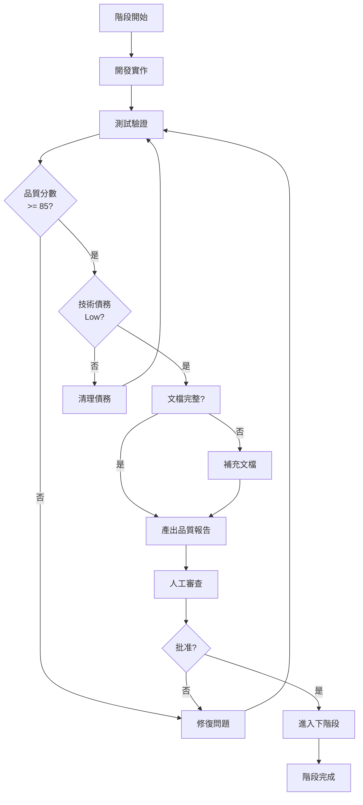

# Genesis Observability - 分階段交付計畫

**文件版本**: v1.0
**創建日期**: 2025-01-07
**專案策略**: 小步快跑，品質優先，零技術債

---

## 🎯 核心原則

```yaml
分階段交付策略:
  1. 每階段獨立可驗證
  2. 每階段交付品質報告
  3. 品質分數 >= 85/100 才進入下階段
  4. 技術債務即時清理
  5. 知識即時累積

品質閘門 (Quality Gate):
  - 代碼品質: >= 85/100
  - 測試覆蓋率: >= 80%
  - 文檔完整度: >= 90%
  - 安全漏洞: 0 critical/high
  - 技術債務: Low
```

---

## 📋 Phase 0: Multi-LLM Router 升級（2-3 天）

### 🎯 目標
將 AI Agent Team 的 LLM Router 升級為支援 Claude + GPT + Gemini 的智能路由系統

### 📦 交付物

#### 1. Claude Provider (✅ 已完成)
- [x] `claude-provider.ts` 實作
- [x] 支援 Claude 3.5 Sonnet API
- [x] 成本估算功能
- [x] Health check 機制

#### 2. LLM Router 升級
- [ ] 支援三方 Provider 註冊
- [ ] 智能路由決策邏輯
- [ ] 品質優先選擇策略
- [ ] Fallback 機制
- [ ] 性能監控

#### 3. 環境配置
- [ ] `.env.example` 更新
- [ ] `ANTHROPIC_API_KEY` 配置
- [ ] Router 策略配置

#### 4. 測試套件
- [ ] Claude Provider 單元測試
- [ ] Router 整合測試
- [ ] 三方 Provider 切換測試
- [ ] 成本計算驗證測試

#### 5. 文檔
- [ ] Multi-LLM Router 使用指南
- [ ] Claude Provider API 文檔
- [ ] 路由策略說明

### ✅ 驗收標準

| 項目 | 標準 | 驗證方式 |
|------|------|---------|
| **功能完整性** | 100% | 所有功能正常運作 |
| **測試覆蓋率** | >= 85% | Vitest coverage report |
| **TypeScript 類型** | 100% strict | tsc --noEmit 通過 |
| **API 回應時間** | < 3s | 壓力測試驗證 |
| **成本估算準確度** | ± 5% | 與實際 billing 比對 |
| **Fallback 成功率** | 100% | 模擬故障測試 |
| **文檔完整度** | >= 90% | Peer review 通過 |

### 📊 品質驗證報告模板

```markdown
# Phase 0 品質驗證報告

## 執行摘要
- 開始日期: YYYY-MM-DD
- 完成日期: YYYY-MM-DD
- 總耗時: X 天
- 品質分數: XX/100

## 測試結果
### 單元測試
- 測試數量: XX
- 通過率: XX%
- 覆蓋率: XX%

### 整合測試
- 場景數量: XX
- 通過率: XX%

### 性能測試
- P50 延遲: XXms
- P95 延遲: XXms
- P99 延遲: XXms

## 代碼品質
- TypeScript 嚴格模式: ✅/❌
- ESLint 警告: X
- 代碼重複度: X%

## 安全掃描
- Critical: 0
- High: 0
- Medium: X
- Low: X

## 技術債務評估
- 債務等級: Low/Medium/High
- 待改進項: X 項
- 預估清理時間: X 小時

## 下階段建議
- [ ] 建議事項 1
- [ ] 建議事項 2

## 批准簽核
- [ ] 技術負責人簽核
- [ ] 品質通過，可進入 Phase 1
```

### 🚧 技術債務預防

**禁止事項**:
- ❌ 跳過測試
- ❌ 註解掉的代碼
- ❌ `any` 類型濫用
- ❌ 硬編碼 API keys
- ❌ 缺少錯誤處理

**必須事項**:
- ✅ 所有函數有 JSDoc
- ✅ 所有邊界情況有測試
- ✅ 所有錯誤有日誌
- ✅ 所有配置可環境變數
- ✅ 所有決策有 inline comments

### 📅 時程規劃

```
Day 1:
  - 上午: LLM Router 升級實作
  - 下午: 單元測試撰寫

Day 2:
  - 上午: 整合測試 + 性能測試
  - 下午: 文檔撰寫

Day 3:
  - 上午: 品質驗證 + 修復問題
  - 下午: 產出品質報告 + 簽核
```

---

## 📋 Phase 1: 知識循環基礎架構（3-4 天）

### 🎯 目標
建立開發日誌系統與知識檢索基礎設施

### 📦 交付物

#### 1. Supabase 知識庫 Schema
- [ ] `development_logs` 表設計
- [ ] `architecture_decisions` 表設計
- [ ] `problem_solutions` 表設計
- [ ] `agent_learning_log` 表設計
- [ ] 向量搜索函數
- [ ] RLS policies
- [ ] 索引優化

#### 2. DevJournalLogger 類別
- [ ] 日誌記錄核心功能
- [ ] Markdown 文件生成
- [ ] Supabase 自動同步
- [ ] Embedding 生成（Gemini）
- [ ] ADR 記錄功能
- [ ] 問題解決記錄

#### 3. 知識檢索引擎
- [ ] 向量相似度搜索
- [ ] 多表聯合查詢
- [ ] 上下文增強邏輯
- [ ] 快取機制

#### 4. 測試 & 驗證
- [ ] Schema migration 測試
- [ ] 向量搜索準確度測試
- [ ] 並發寫入測試
- [ ] 性能基準測試

### ✅ 驗收標準

| 項目 | 標準 | 驗證方式 |
|------|------|---------|
| **Schema 正確性** | 100% | Migration 無錯誤 |
| **向量搜索準確率** | >= 85% | 人工評估相關性 |
| **寫入性能** | >= 100 ops/s | 壓力測試 |
| **查詢性能** | < 200ms (P95) | 基準測試 |
| **文檔完整度** | >= 90% | Schema 文檔審查 |

### 📊 品質驗證重點

```yaml
資料庫品質:
  - Migration 可回滾
  - 索引策略正確
  - RLS policies 安全
  - 備份機制就緒

代碼品質:
  - 所有 async 函數有錯誤處理
  - 所有 DB 操作有 retry
  - 所有向量操作有驗證

性能品質:
  - 向量搜索 < 200ms
  - 批量插入 >= 100/s
  - 記憶體使用 < 100MB
```

---

## 📋 Phase 2: AI Agent 訓練系統（3-4 天）

### 🎯 目標
實作 AI Agent 自主學習與知識應用系統

### 📦 交付物

#### 1. AgentTrainingSystem 類別
- [ ] 任務前知識檢索
- [ ] 上下文增強提示
- [ ] 執行結果記錄
- [ ] 品質評分機制
- [ ] 學習曲線追蹤

#### 2. RAG 整合
- [ ] Agent → Knowledge Retrieval
- [ ] Enhanced Prompt 生成
- [ ] Feedback Loop 建立

#### 3. 監控儀表板（簡易版）
- [ ] Agent 執行統計
- [ ] 品質趨勢圖
- [ ] 成本追蹤
- [ ] 學習效果可視化

### ✅ 驗收標準

| 項目 | 標準 | 驗證方式 |
|------|------|---------|
| **知識檢索準確率** | >= 80% | A/B 測試對比 |
| **Agent 品質提升** | Week 2 > Week 1 | 統計分析 |
| **系統穩定性** | 99% uptime | 7 天運行測試 |
| **成本控制** | LLM < $30 | 實際 billing |

---

## 📋 Phase 3: Observability 核心功能（5-7 天）

### 🎯 目標
實作 obs-edge Worker 與基礎 Dashboard

### 📦 交付物

#### 1. obs-edge Worker
- [ ] `/ingest` 端點
- [ ] `/metrics` 端點
- [ ] `/costs` 端點
- [ ] Supabase 整合
- [ ] Rate limiting

#### 2. obs-dashboard (MVP)
- [ ] Metrics 即時圖表
- [ ] Cost 趨勢圖
- [ ] 基礎篩選功能

#### 3. CI/CD Pipeline
- [ ] GitHub Actions workflows
- [ ] 自動化測試
- [ ] 自動化部署

### ✅ 驗收標準

| 項目 | 標準 | 驗證方式 |
|------|------|---------|
| **API 性能** | P95 < 400ms | 壓力測試 |
| **資料準確性** | 100% | 端對端驗證 |
| **UI 載入速度** | < 3s | Lighthouse |
| **安全性** | 0 漏洞 | 安全掃描 |

---

## 📋 Phase 4: 進階功能 & 優化（待定）

*根據 Phase 0-3 的經驗再詳細規劃*

---

## 🎯 品質分數計算公式

```typescript
品質分數 = (
  功能完整性 × 0.25 +
  測試覆蓋率 × 0.20 +
  代碼品質 × 0.20 +
  性能指標 × 0.15 +
  安全性 × 0.10 +
  文檔完整度 × 0.10
) × 100

通過標準: >= 85/100
```

---

## 🚦 階段閘門決策流程



---

## 📊 整體時程規劃

```
Phase 0: Multi-LLM Router     [2-3 天]  ████████░░
Phase 1: 知識循環基礎         [3-4 天]  ░░░░░░████
Phase 2: AI 訓練系統          [3-4 天]  ░░░░░░░░░░████
Phase 3: Observability 核心   [5-7 天]  ░░░░░░░░░░░░░░██████

總計: 13-18 天 (品質優先模式)
```

---

## ✅ 當前狀態

**Phase 0 進度**: 30% 完成
- [x] Claude Provider 已實作
- [ ] LLM Router 升級（進行中）
- [ ] 測試套件
- [ ] 文檔
- [ ] 品質驗證報告

**下一步行動**:
1. 完成 LLM Router 升級
2. 撰寫完整測試套件
3. 執行品質驗證
4. 產出 Phase 0 品質報告
5. 人工審查 & 批准

---

## 📝 變更歷史

| 日期 | 版本 | 變更內容 | 作者 |
|------|------|---------|------|
| 2025-01-07 | v1.0 | 初始版本，定義 4 個階段 | Claude Code |

---

**核心價值**: 小步快跑，品質優先，零技術債，持續交付

**批准狀態**: ⏳ 待批准
