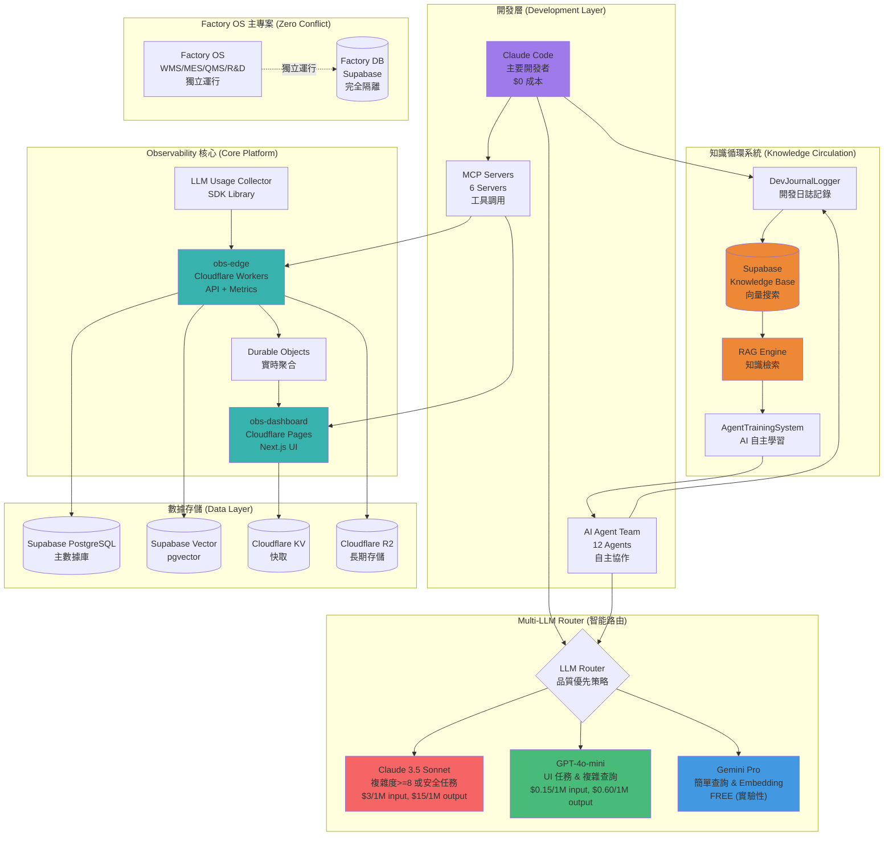
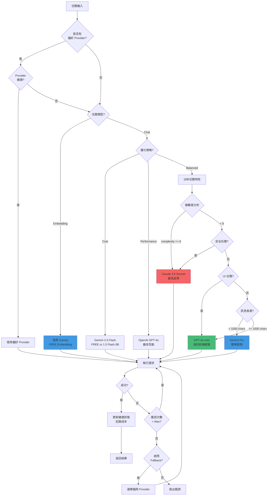
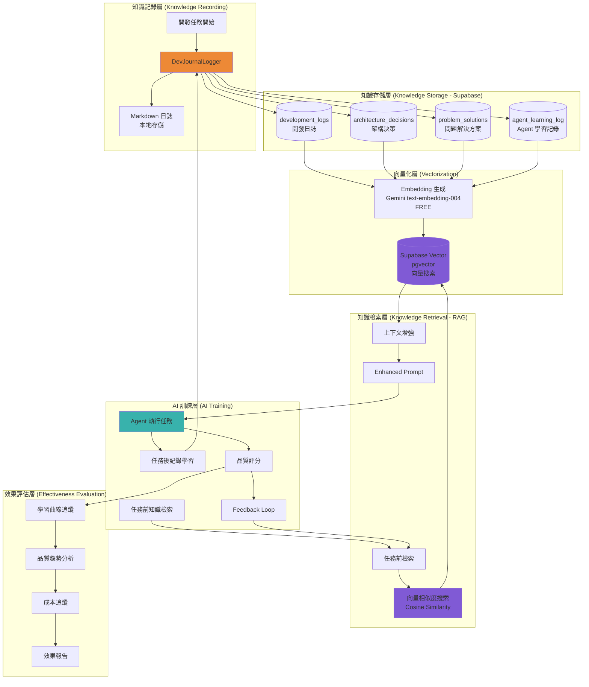
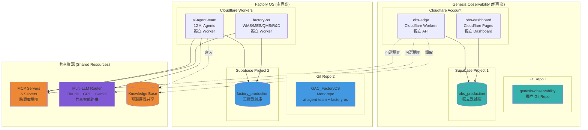
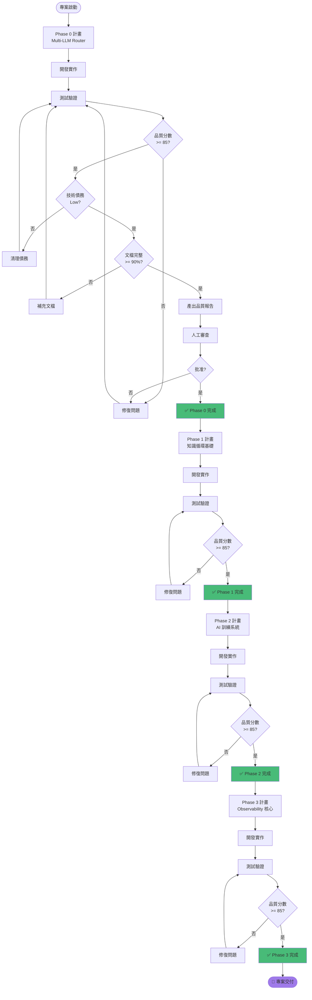
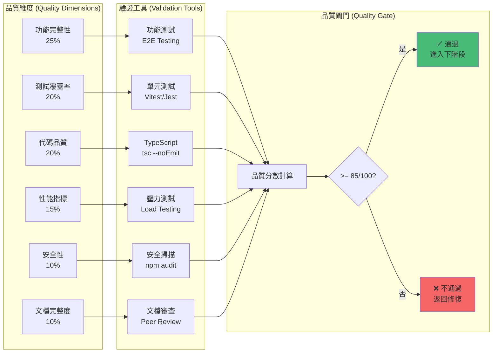
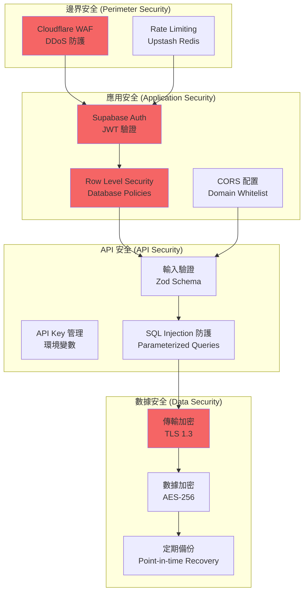
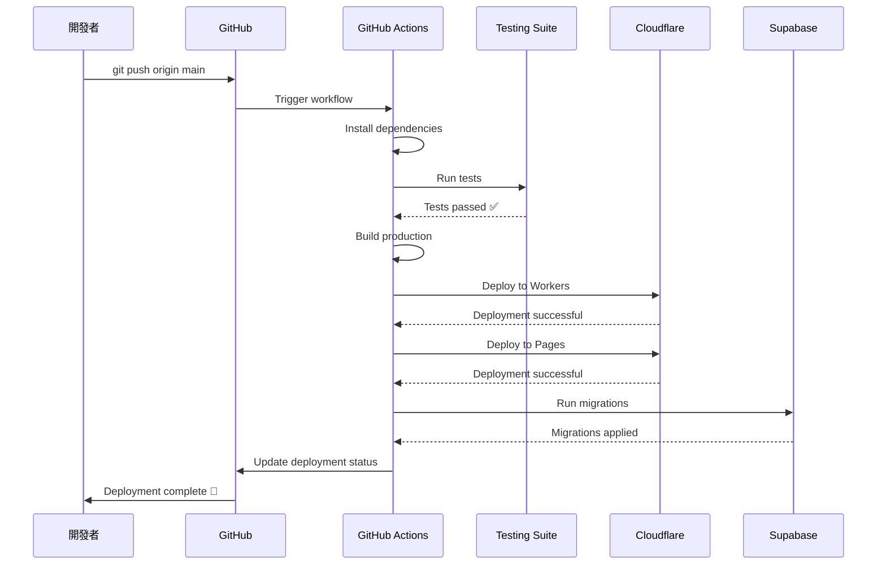
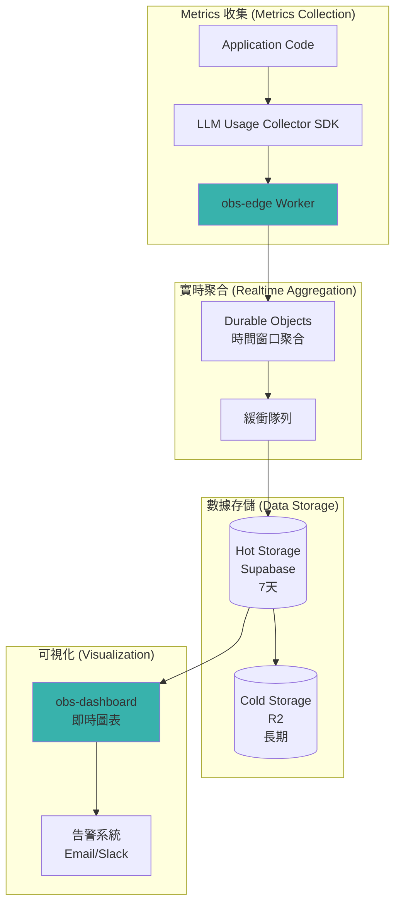
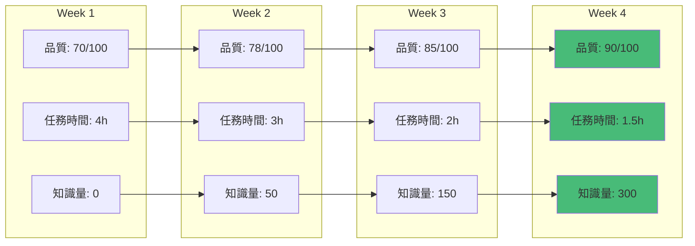

# Genesis Observability - 系統架構圖

**文件版本**: v1.0
**創建日期**: 2025-01-07
**專案**: Genesis Observability Platform
**目的**: 完整執行藍圖與架構設計文檔

---

## 🏗️ 整體系統架構

---

## 🎯 Multi-LLM Router 決策流程

---

## 🔄 知識循環系統架構

---

## 🏭 Zero-Conflict 整合架構

---

## 📊 Phase-based Delivery 流程圖

---

## 🎯 品質驗證體系

---

## 🚀 技術棧總覽

### 前端 (Frontend)
- **Framework**: Next.js 15 (React 18)
- **Language**: TypeScript 5
- **Styling**: Tailwind CSS 3
- **State**: React Query (TanStack Query)
- **Deployment**: Cloudflare Pages

### 後端 (Backend)
- **Runtime**: Cloudflare Workers (Edge Computing)
- **API**: tRPC 11 (Type-safe API)
- **Realtime**: Durable Objects
- **Language**: TypeScript 5

### 數據庫 (Database)
- **Primary DB**: Supabase PostgreSQL
- **Vector DB**: Supabase Vector (pgvector)
- **Cache**: Cloudflare KV
- **Storage**: Cloudflare R2

### AI/LLM Stack
- **Claude**: 3.5 Sonnet (複雜任務)
- **OpenAI**: GPT-4o-mini (UI & 標準任務)
- **Google**: Gemini Pro (簡單任務 & Embedding)
- **Router**: 自建 Multi-LLM Router

### 開發工具 (DevTools)
- **MCP Servers**: 6 Servers (Cloudflare, Supabase, PostgreSQL, GitHub, Playwright, Gemini)
- **Testing**: Vitest + Playwright
- **CI/CD**: GitHub Actions
- **Monorepo**: Turborepo
- **Package Manager**: pnpm

---

## 📈 成本估算

### LLM 成本 (每專案階段)

| Provider | 用途 | 預估用量 | 單價 | 成本 |
|----------|------|----------|------|------|
| **Claude 3.5 Sonnet** | 複雜任務 & 安全 | 5M input + 2M output | $3/$15 per 1M | $45 |
| **GPT-4o-mini** | UI & 標準開發 | 20M input + 10M output | $0.15/$0.60 per 1M | $9 |
| **Gemini Pro** | 簡單查詢 & Docs | FREE (實驗性) | $0 | $0 |
| **Gemini Embedding** | 向量生成 | FREE | $0 | $0 |
| **總計** | - | - | - | **$54/階段** |

### 基礎設施成本 (每月)

| 服務 | 用途 | 方案 | 成本 |
|------|------|------|------|
| **Cloudflare Workers** | Edge API | Free (100K req/day) | $0 |
| **Cloudflare Pages** | Frontend | Free | $0 |
| **Cloudflare KV** | Cache | Free (1GB) | $0 |
| **Cloudflare R2** | Storage | Free (10GB) | $0 |
| **Supabase** | Database | Free (500MB) | $0 |
| **GitHub** | Code hosting | Free | $0 |
| **總計** | - | - | **$0/月** |

**專案總預算**: ~$216 (4 Phases × $54)
**運行成本**: $0/月 (Free Tier)

---

## 🔐 安全架構

---

## 📝 部署流程

---

## 🎯 監控與可觀測性

---

## 🎓 知識累積效果預期

---

## 📋 總結

### 核心設計原則
1. **品質優先**: LLM 路由以品質與成本平衡為主，不犧牲代碼品質
2. **知識累積**: 所有開發知識即時記錄，投入 AI 自主訓練強化
3. **階段交付**: 小步快跑，每階段獨立驗證，品質分數 >= 85/100
4. **零衝突**: 與 Factory OS 完全隔離，獨立 Git Repo、數據庫、Worker
5. **自動化**: GitHub 定時備份，CI/CD 自動化部署，知識自動循環

### 交付時程
- **Phase 0**: Multi-LLM Router (2-3 天) ✅ **已完成**
- **Phase 1**: 知識循環基礎 (3-4 天)
- **Phase 2**: AI 訓練系統 (3-4 天)
- **Phase 3**: Observability 核心 (5-7 天)
- **總計**: 13-18 天

### 預期成果
- **零技術債**: 每階段清理技術債，維持高代碼品質
- **知識增長**: 4 週後 AI 品質提升至 90/100，開發效率提升 2.5 倍
- **成本控制**: LLM 成本 ~$216，基礎設施 $0/月
- **高可用性**: Edge Computing + 全球分發，P95 延遲 < 400ms

---

**文檔版本**: v1.0
**最後更新**: 2025-01-07
**維護者**: Claude Code + AI Agent Team
**審核狀態**: ⏳ 待審核

